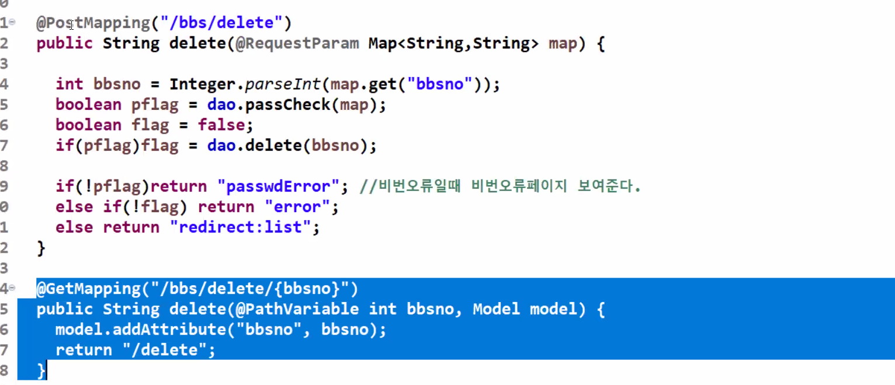
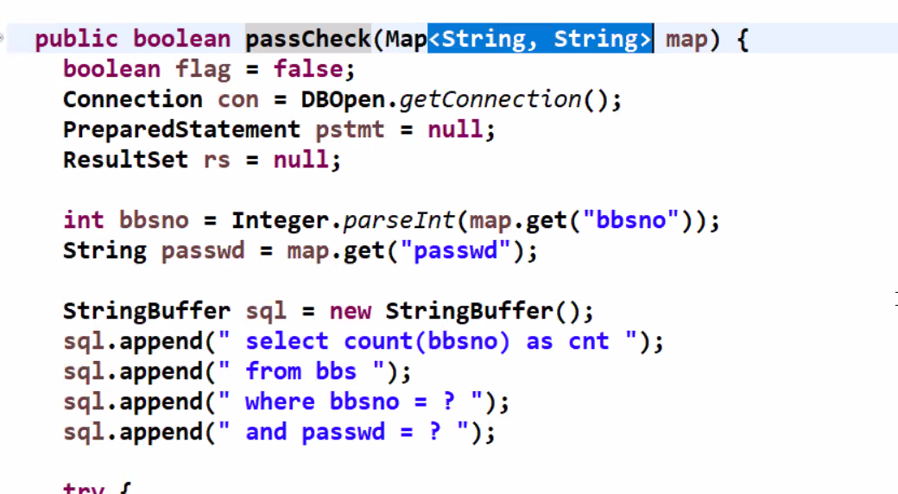

## [01] Form 값의 검증, Validator interface 사용

\- 검증시 사용자 입력의 에러는 Javascript로 검증하여 에러 메시지 출력

\- 정상적인 폼을 우회하여 전송된 데이터 검증을 위하여 Controller에서 재검증
\- sample project 계속 사용
\- build.gradle 에 Validator 라이브러리 추가
 Gradle -> Refresh Gradle Project

build.gradle 수정

```java
plugins {
	id 'org.springframework.boot' version '2.7.0'
	id 'io.spring.dependency-management' version '1.0.11.RELEASE'
	id 'java'
	id 'war'
}

group = 'com.example'
version = '0.0.1-SNAPSHOT'
sourceCompatibility = '17'

repositories {
	mavenCentral()
}

dependencies {
        implementation 'org.springframework.boot:spring-boot-starter-web'
        providedRuntime 'org.springframework.boot:spring-boot-starter-tomcat'
        testImplementation 'org.springframework.boot:spring-boot-starter-test'
        
        // https://mvnrepository.com/artifact/org.springframework.boot/spring-boot-devtools
        implementation group: 'org.springframework.boot', name: 'spring-boot-devtools', version: '2.4.3'
              implementation 'javax.servlet:jstl'
        implementation 'org.apache.tomcat.embed:tomcat-embed-jasper'
        implementation 'org.springframework.boot:spring-boot-starter-validation'    
}


tasks.named('test') {
	useJUnitPlatform()
}

```


### 1. VO Class

CalcVO.java 생성

```java
package com.example.validator;

public class CalcVO {
  private String menu;
  private int price;
  private int count;
  private int payment;
  
  public String getMenu() {
    return menu;
  }
  public void setMenu(String menu) {
    this.menu = menu;
  }
  public int getPrice() {
    return price;
  }
  public void setPrice(int price) {
    this.price = price;
  }
  public int getCount() {
    return count;
  }
  public void setCount(int count) {
    this.count = count;
  }
  public int getPayment() {
    return payment;
  }
  public void setPayment(int payment) {
    this.payment = payment;
  }
  
}

```


### 2. Validator class
\- 유효성 검증 클래스 선언

CalcValidator.java 생성

```java
package com.example.validator;

import org.springframework.validation.Errors;
import org.springframework.validation.Validator;

public class CalcValidator implements Validator {

  @Override
  public boolean supports(Class<?> clazz) {
    // TODO Auto-generated method stub
    return CalcVO.class.isAssignableFrom(clazz);
  }

  @Override
  public void validate(Object target, Errors errors) {
    CalcVO calcVO = (CalcVO)target;
    String menu = calcVO.getMenu();
    if(menu == null || menu.trim().isEmpty()) {
      System.out.println("메뉴명 등록이 누락되었습니다.");
      errors.rejectValue("menu", "error");
    }
    
    int price = calcVO.getPrice();
    if(price < 1000 || price >= 10000000) {
      System.out.println("가격은 1,000원 이상 10,000,000원 이하여야 합니다.");
      errors.rejectValue("price", "error");
  }
    int count = calcVO.getCount();
    if(count <= 0 || count >= 1000) {
      System.out.println("수량은 1개 이상 1,000개 이하여야 합니다.");
      errors.rejectValue("count", "error");
    }
  }
}
```


### 3. Controller class

```java
package com.example.validator;
 
import org.springframework.stereotype.Controller;
import org.springframework.ui.Model;
import org.springframework.validation.BindingResult;
import org.springframework.web.bind.annotation.GetMapping;
import org.springframework.web.bind.annotation.PostMapping;
 
@Controller 
public class CalcController {
  public CalcController() {
    System.out.println("--> CalcController created.");
  }
  // http://localhost:8000/calc
  @GetMapping("/calc")
  public String calc() {
    return "/calc/form";
  }
  // 에러가 발생했을때 자동으로 이전 폼으로 이동
  @PostMapping("/calc")
  public String calc(CalcVO calcVO, 
             BindingResult result,
             Model model) {
     
    CalcValidator calcValidator = new CalcValidator();
    calcValidator.validate(calcVO, result);  // 검증
    
    if (result.hasErrors()) { // 에러 발생시
      return "/calc/form";
    } else { // 에러 미발생
      int payment = calcVO.getPrice() * calcVO.getCount();
      model.addAttribute("payment", payment);
      return "/calc/proc"; 
    }
  }  
}
```


### 4. SampleApplication에 새로운 패키지 추가 등록
\- @ComponentScan(basePackages = {"com.example.validator"});
  Controller등 자동 인식 package 설정

SampleApplication .java 수정

```java
package com.example.sample;

import org.springframework.boot.SpringApplication;
import org.springframework.boot.autoconfigure.SpringBootApplication;
import org.springframework.context.annotation.ComponentScan;

@SpringBootApplication
@ComponentScan(basePackages= {"com.example.*"})
public class SampleApplication {

	public static void main(String[] args) {
		SpringApplication.run(SampleApplication.class, args);
	}

}
```


### 5. View 페이지

proc.jsp 생성

```jsp
<%@ page language="java" contentType="text/html; charset=UTF-8"
    pageEncoding="UTF-8"%>
<!DOCTYPE html>
<html>
<head>
  <title>proc.jsp</title>
  <meta charset="utf-8">
  <meta name="viewport" content="width=device-width, initial-scale=1">
  <link rel="stylesheet" href="https://maxcdn.bootstrapcdn.com/bootstrap/3.4.1/css/bootstrap.min.css">
  <script src="https://ajax.googleapis.com/ajax/libs/jquery/3.5.1/jquery.min.js"></script>
  <script src="https://maxcdn.bootstrapcdn.com/bootstrap/3.4.1/js/bootstrap.min.js"></script>
</head>
<body> 
 
<div class="container">
  <h2>메뉴명</h2>
  <div class="panel panel-default">
    <div class="panel-body">${param.menu }</div>
  </div>
  <h2>가격</h2>
  <div class="panel panel-default">
    <div class="panel-body">${param.price }</div>
  </div>
  <h2>수량</h2>
  <div class="panel panel-default">
    <div class="panel-body">${param.count }</div>
  </div>
  <h2>결제</h2>
  <div class="panel panel-default">
    <div class="panel-body">${payment }</div>
  </div>
</div>
</body>
</html>
```


form.jsp 수정

```jsp
<%@ page language="java" contentType="text/html; charset=UTF-8"
    pageEncoding="UTF-8"%>
<!DOCTYPE html>
<html>
<head>
  <title>form.jsp</title>
  <meta charset="utf-8">
  <meta name="viewport" content="width=device-width, initial-scale=1">
  <link rel="stylesheet" href="https://maxcdn.bootstrapcdn.com/bootstrap/3.4.1/css/bootstrap.min.css">
  <script src="https://ajax.googleapis.com/ajax/libs/jquery/3.5.1/jquery.min.js"></script>
  <script src="https://maxcdn.bootstrapcdn.com/bootstrap/3.4.1/js/bootstrap.min.js"></script>
</head>
<body>
 
<div class="container">
  <h2>form.jsp</h2>
  <form class="form-horizontal" method="post" action="./calc">
    <div class="form-group">
      <label class="control-label col-sm-2" for="menu">메뉴명:</label>
      <div class="col-sm-8">
        <input type="text" class="form-control" autofocus="autofocus" id="menu" value="김밥" name="menu">
      </div>
    </div>
    <div class="form-group">
      <label class="control-label col-sm-2" for="price">가격:</label>
      <div class="col-sm-8">          
        <input type="number" class="form-control" id="price" name="price" value="3000">
      </div>
    </div>
    <div class="form-group">
      <label class="control-label col-sm-2" for="count">수량:</label>
      <div class="col-sm-8">          
        <input type="number" class="form-control" id="count" name="count" value="2">
      </div>
    </div>
    <div class="form-group">        
      <div class="col-sm-offset-2 col-sm-10">
        <button type="submit" class="btn btn-default">처리</button>
      </div>
    </div>
  </form>
</div>
 
</body>
</html>
```


### 6. 실행결과

(1) 정상처리


(2) 비정상 처리되는 경우
\- 유효성 검사후 오류이면 다시 form으로 이동한다.


---

---


## [01] Form 값의 검증, 에러 메세지 출력
### 1. Controller class 변경

CalcController 2 생성

```java
package com.example.validator;
 
import java.util.HashMap;
import java.util.Map;
 
import org.springframework.stereotype.Controller;
import org.springframework.ui.Model;
import org.springframework.validation.BindingResult;
import org.springframework.web.bind.annotation.GetMapping;
import org.springframework.web.bind.annotation.PostMapping;
 
@Controller
public class CalcController2 {
  public CalcController2() {
    System.out.println("--> CalcController2 created.");
  }
 
  // http://localhost:8000/calc
  @GetMapping("/calc2")
  public String calc() {
    return "/calc/form2";
 
  }
 
  // 에러가 발생했을때 자동으로 이전 폼으로 이동
  @PostMapping("/calc2")
  public String calc(CalcVO calcVO, 
  BindingResult result,
  Model model) {
     
    CalcValidator calcValidator = new CalcValidator();
    calcValidator.validate(calcVO, result);  // 검증
    Map<String,String> errors = new HashMap<String,String>();
    
    if (result.hasErrors()) { // 에러 발생시
      if (result.getFieldError("menu") != null) { // 구체적인 필드별 에러 확인
        // errors.rejectValue("menu", "값 누락 error"); 의 메시지 출력됨.
        System.out.println("menu: " + result.getFieldError("menu").getCode()); 
        errors.put("menu","menu가 등록이 누락되었습니다.");
      }
      
      if (result.getFieldError("price") != null) {
        System.out.println("price: " + result.getFieldError("price").getCode());
        errors.put("price","금액은 1000원이상 천만원 이하여야합니다");
        
      }
      
      if (result.getFieldError("count") != null) {
        System.out.println("count: " + result.getFieldError("count").getCode());
        errors.put("count","수량은 1개이상 천개 이하여야합니다.");
        
      }
  
      model.addAllAttributes(errors);            
      return "/calc/form2";
    } else { // 에러 미발생
      int payment = calcVO.getPrice() * calcVO.getCount();
      model.addAttribute("payment", payment);
      return "/calc/proc"; 
    }
  }  
}
```


### 2. View 페이지 작성

form2.jsp 생성

```jsp
<%@ page language="java" contentType="text/html; charset=UTF-8"
    pageEncoding="UTF-8"%>
<!DOCTYPE html>
<html>
<head>
  <title>form.jsp</title>
  <meta charset="utf-8">
  <meta name="viewport" content="width=device-width, initial-scale=1">
  <link rel="stylesheet" href="https://maxcdn.bootstrapcdn.com/bootstrap/3.4.1/css/bootstrap.min.css">
  <script src="https://ajax.googleapis.com/ajax/libs/jquery/3.5.1/jquery.min.js"></script>
  <script src="https://maxcdn.bootstrapcdn.com/bootstrap/3.4.1/js/bootstrap.min.js"></script>
</head>
<body>
 
<div class="container">
  <h2>form.jsp</h2>
  <form class="form-horizontal" method="post" action="./calc2">
    <div class="form-group">
      <label class="control-label col-sm-2" for="menu">메뉴명:</label>
      <div class="col-sm-8">
        <input type="text" class="form-control" autofocus="autofocus" id="menu" value="김밥" name="menu">
      </div>      
    </div>
    <div class="form-group">
    <label class="control-label col-sm-10" style="color:purple;" >${menu}</label>
    </div>
    <div class="form-group">
      <label class="control-label col-sm-2" for="price">가격:</label>
      <div class="col-sm-8">          
        <input type="number" class="form-control" id="price" name="price" value="3000">
      </div>
    </div>
    <div class="form-group">
    <label class="control-label col-sm-10" style="color:purple;">${price}</label>
    </div>
    <div class="form-group">
      <label class="control-label col-sm-2" for="count">수량:</label>
      <div class="col-sm-8">          
        <input type="number" class="form-control" id="count" name="count" value="2">
      </div>
    </div>
    <div class="form-group">
    <label class="control-label col-sm-10" style="color:purple;" >${count}</label>
    </div>
    <div class="form-group">        
      <div class="col-sm-offset-2 col-sm-10">
        <button type="submit" class="btn btn-default">처리</button>
      </div>
    </div>
  </form>
</div>
</body>
</html>
```


---

---


## [01] Form 값의 검증, Annotation을 이용한 검증

\- VO class 필드에 validation Annotation 등록한다.

### 1. VO Class

```java
package com.example.validator;

import javax.validation.constraints.Max;
import javax.validation.constraints.Min;
import javax.validation.constraints.NotEmpty;
import javax.validation.constraints.Size;
 
public class CalcVOAnnotation {
  // 우선순위: @NotEmpty -> @Size
  @NotEmpty(message = "메뉴명은 필수 입력입니다(Not empty).")
  @Size(min = 2, max = 30, message = "메뉴명은 2자이상 30자 미만입니다.")
  private String menu;
  @Max(value = 1000000, message = "금액은 100만원 이하여야 합니다.")
  @Min(value = 1000, message = "금액은 1000원 이상이어야 합니다.")
  private int price;
  @Max(value = 100, message = "수량은 100개 이하여야 합니다.")
  @Min(value = 1, message = "수량은 1개 이상이어야 합니다.")
  private int count;
  private int payment;
  public String getMenu() {
    return menu;
  }
  public void setMenu(String menu) {
    this.menu = menu;
  }
  public int getPrice() {
    return price;
  }
  public void setPrice(int price) {
    this.price = price;
  }
  public int getCount() {
    return count;
  }
  public void setCount(int count) {
    this.count = count;
  }
  public int getPayment() {
    return payment;
  }
  public void setPayment(int payment) {
    this.payment = payment;
  }
}
```


### 2. Validatator class 
\- 사용하지 않음


### 3. Controller class

CalcController3.java 생성

```java
package com.example.validator;
 
import java.util.HashMap;
import java.util.Map;

import javax.validation.Valid;

import org.springframework.stereotype.Controller;
import org.springframework.ui.Model;
import org.springframework.validation.BindingResult;
import org.springframework.web.bind.annotation.GetMapping;
import org.springframework.web.bind.annotation.PostMapping;

@Controller
public class CalcController3 {
  public CalcController3() {
    System.out.println("--> CalcController3 created.");
  }
 
  // http://localhost:8000/calc3
  @GetMapping("/calc3")
  public String calc() {
    return "/calc/form3";
 
  }
 
  // 에러가 발생했을때 자동으로 이전 폼으로 이동
  @PostMapping("/calc3")
  public String calc(@Valid CalcVOAnnotation calcVO, 
      BindingResult result,
      Model model) {
     
    Map<String,String> errors = new HashMap<String,String>();
    
    if (result.hasErrors()) { // 에러 발생시
      if (result.getFieldError("menu") != null) { 
        System.out.println("menu: " + result.getFieldError("menu").getDefaultMessage()); 
        errors.put("menu","menu가 등록이 누락되었습니다.");
      }
      
      if (result.getFieldError("price") != null) {
        System.out.println("price: " + result.getFieldError("price").getDefaultMessage());
        errors.put("price","금액은 1000원이상 천만원 이하여야합니다");
        
      }
      
      if (result.getFieldError("count") != null) {
        System.out.println("count: " + result.getFieldError("count").getDefaultMessage());
        errors.put("count","수량은 1개이상 천개 이하여야합니다.");
        
      }
  
      model.addAllAttributes(errors);            
      return "/calc/form3";
    } else { // 에러 미발생
      int payment = calcVO.getPrice() * calcVO.getCount();
      model.addAttribute("payment", payment);
      return "/calc/proc"; 
    }
  }  
}
 
```


### 4. View 페이지

form3.jsp 생성

```jsp
<%@ page language="java" contentType="text/html; charset=UTF-8"
    pageEncoding="UTF-8"%>
<!DOCTYPE html>
<html>
<head>
  <title>form3.jsp</title>
  <meta charset="utf-8">
  <meta name="viewport" content="width=device-width, initial-scale=1">
  <link rel="stylesheet" href="https://maxcdn.bootstrapcdn.com/bootstrap/3.4.1/css/bootstrap.min.css">
  <script src="https://ajax.googleapis.com/ajax/libs/jquery/3.5.1/jquery.min.js"></script>
  <script src="https://maxcdn.bootstrapcdn.com/bootstrap/3.4.1/js/bootstrap.min.js"></script>
</head>
<body>
 
<div class="container">
  <h2>form3.jsp</h2>
  <form class="form-horizontal" method="post" action="calc3">
    <div class="form-group">
      <label class="control-label col-sm-2" for="menu">메뉴명:</label>
      <div class="col-sm-8">
        <input type="text" class="form-control" autofocus="autofocus" id="menu" value="김밥" name="menu">
      </div>      
    </div>
    <div class="form-group">
    <label class="control-label col-sm-10" style="color:purple;" >${menu}</label>
    </div>
    <div class="form-group">
      <label class="control-label col-sm-2" for="price">가격:</label>
      <div class="col-sm-8">          
        <input type="number" class="form-control" id="price" name="price" value="3000">
      </div>
    </div>
    <div class="form-group">
    <label class="control-label col-sm-10" style="color:purple;">${price}</label>
    </div>
    <div class="form-group">
      <label class="control-label col-sm-2" for="count">수량:</label>
      <div class="col-sm-8">          
        <input type="number" class="form-control" id="count" name="count" value="2">
      </div>
    </div>
    <div class="form-group">
    <label class="control-label col-sm-10" style="color:purple;" >${count}</label>
    </div>
    <div class="form-group">        
      <div class="col-sm-offset-2 col-sm-10">
        <button type="submit" class="btn btn-default">처리</button>
      </div>
    </div>
  </form>
</div>
</body>
</html>
```


---

---


## [01] 스프링 MVC의 주요 구성 요소 

### 1. MVC 패턴의 구조는 Model, View, Controller 세 가지로 나누어진다.

 \- 모델은 비즈니스 로직과 DB 등에 대한 처리를 수행한다.

\- 컨트롤러는 뷰와 모델을 이어주는 역할을 맡는다. 뷰의 요청에 따라 모델의 상태를 바꾸고, 이를 다시 뷰에 전달한다.

\- 뷰는 사용자에게 보이는 영역이다. 컨트롤러를 통해 모델에 질의를 보내고 그 값을 사용자에게 적절하게 보여준다.


## [02] Spring 웹 계층
### 1.  스프링에는 5가지 요소가 존재한다.


(1) Web Layer

 \- 컨트롤러(@Controller)와 JSP등의 뷰 영역이다.
 \- 이외에도 필터(@filter), 인터셉터, 컨트롤러 어드바이스 등 외부 요청과 응답에 대한 전반적인 영역을 의미한다.


(2) Service Layer

\- 서비스 영역(@Service)이다.

\- 일반적으로 컨트롤러와 저장소(Repository, Dao)의 중간에 위치한다.

\- 트랜잭션(@Transactional)이 사용되어야 하는 영역이다.


(3) Repository Layer

\- DB와 같은 데이터 저장소에 접근하는 영역이다.
\- DAO(Data Access Object)영역이다.
 

(4) DTOs

\- DTO(Data Transfer Object)는 계층 간의 데이터 교환을 위한 객체이며 이들의 영역이다.


(5) Domain model

\- 개발 대상, 즉 도메인을 모든 사람이 동일한 관점에서 이해할 수 있고 공유할 수 있도록 단순화한 것을 도메인 모델이라고 한다.

\- JPA를 사용한다면, @Entity가 사용되는 영역 역시 도메인 모델이라 할 수 있다.


## [03] Annotation  

### 1. Spring MVC 어노테이션

@Controller     - 클래스 타입에만 적용되며,웹 요청처리에 사용
@RequestMapping - 컨트롤러가 처리할 Get/Post방식 요청URL을 명시(클래스,메소드)
@GetMapping    - 컨트롤러가 처리할 Get방식 요청URL을 명시(메소드)
@PostMapping   - 컨트롤러가 처리할 POST방식 요청URL을 명시(메소드)

(1) 컨트롤러 메소드의 매개변수(파라메터) 타입


 @RequestBody : JSON데이터를 서버에 보내서 원하는 타입의 객체로 변환하는 용도로 사용


 (2) 컨트롤러 메소드의 리턴값 타입


@ResponseBody : JSP와 같은 뷰가 전달되는 것이 아니라 데이터 자체를 전달하기 위한 용도(Ajax 응답데이터)로 사용된다.   


### 2. 그외 어노테이션
 @PathVariable  - Parameter를 URL형식으로 받기                     
 @RequestParam - Form페이지에서 넘어오는 파라메터를 받을수 있다.     
 \- 해당 파라미터가 없다면 HTTP 400 - Bad Request 가 전달 된다. 
 ` public String edit( @RequestParam("id") int id, 
           	 		   @RequestParam("title") String title, 
				       @RequestParam("file") MultipartFile file ) {...} `

 \- 파라미터가 필수가 아니라면 required = false 로 지정하면 된다. 
  파라미터가 없으면 NULL이 들어간다. default 값을 지정 할 수도 있다. 
`  public void view( @RequestParam(value = "id", 
                                required = false, 
					        defaultValue = "0" ) int id) {..}.   `

 \- @RequestParam을 생략하여 사용할수 있다.
  Map타입으로 데이터를 받을경우는 반드시 @RequestParam을
  명시해야 데이터를 받아온다.

 `<input type="text" name="id" /><br>
 <input type="password" name="passwd" /> 
    
 public String add( @RequestParam Map<String, String> params ) {...} `


 @ModelAttribute  - 파라미터를 Object(DTO) 형태로 받을때 사용
 ex) public void update( @ModelAttribute("board") Board board) {...} 

 @SessionAttributes - 세션상에서 model의 정보를 유지하고 싶을 경우 사용
 @RequestBody    - JSON 데이터를 원하는 타입으로 바인딩 처리 


---

---


[01] Mybatis 프레임워크

\- 아파치(Apache) 소프트웨어 재단의 IBatis 개발자팀이 구글 코드로
 이전하고, 구글 코드에서는 이름이 MyBatis로 변경되었다.


\1. Mybatis 프레임 특징
\- 한두줄의 자바코드로 DB연동을 처리한다. 코드길이가 줄어들었다.
\- SQL 명령어를 자바코드에서 분리하여 XML 파일에 따로 관리한다.

\- 이식성이 좋아 어떤 프로그래밍 언어로도 구현 가능

\- 오픈소스이며 무료임

(1) Mybatis Component Flow

\- Mybatis Framework가 Business Layer(Persistance Layer + Service Layer)
 와 DB Layer사이 가운데서 양쪽을 연결하고 있다.

\- 하단의 mapper.xml 파일을 이용하여 쿼리문을 별도로 작성한다.

새로운 프로젝트 생성


build.gradle 수정

```java
plugins {
	id 'org.springframework.boot' version '2.7.0'
	id 'io.spring.dependency-management' version '1.0.11.RELEASE'
	id 'java'
	id 'war'
}

group = 'com.study.bbs'
version = '0.0.1-SNAPSHOT'
sourceCompatibility = '11'

repositories {
	mavenCentral()
}

dependencies {
	implementation 'org.springframework.boot:spring-boot-starter-jdbc'
	implementation 'org.springframework.boot:spring-boot-starter-web'
	implementation 'org.mybatis.spring.boot:mybatis-spring-boot-starter:2.2.2'
	developmentOnly 'org.springframework.boot:spring-boot-devtools'
	// runtimeOnly 'mysql:mysql-connector-java'
	providedRuntime 'org.springframework.boot:spring-boot-starter-tomcat'
	testImplementation 'org.springframework.boot:spring-boot-starter-test'
  	implementation 'javax.servlet:jstl'
    implementation 'org.apache.tomcat.embed:tomcat-embed-jasper'
}

tasks.named('test') {
	useJUnitPlatform()
}
```


application.properties 수정

```properties
server.port = 8000
# DEVTOOLS (DevToolsProperties)
spring.devtools.livereload.enabled=true
# jsp 설정
spring.mvc.view.prefix=/WEB-INF/views/
spring.mvc.view.suffix=.jsp
```


폴더생성


SpringBbsApplication.java 수정

```java
package com.study.bbs;

import org.springframework.boot.SpringApplication;
import org.springframework.boot.autoconfigure.SpringBootApplication;
import org.springframework.context.annotation.ComponentScan;

@SpringBootApplication
@ComponentScan(basePackages= {"com.study.*"})
public class SpringBbsApplication {

	public static void main(String[] args) {
		SpringApplication.run(SpringBbsApplication.class, args);
	}

}
```


패키지 생성


import  mvc_bbs


mvc_bbs에 있는 model / utility 패키지 붙여넣기 

BbsDAO import 수정

```java
package com.study.model;

import java.sql.Connection;
import java.sql.PreparedStatement;
import java.sql.ResultSet;
import java.sql.SQLException;
import java.util.ArrayList;
import java.util.List;
import java.util.Map;

import org.springframework.stereotype.Component;

import com.study.utility.DBClose;
import com.study.utility.DBOpen;

@Component
public class BbsDAO {

```

views 폴더 붙여넣기 / index.jsp 붙여넣기 / images 폴더 static에 붙여넣기


build.gradle 수정

```java
plugins {
	id 'org.springframework.boot' version '2.7.0'
	id 'io.spring.dependency-management' version '1.0.11.RELEASE'
	id 'java'
	id 'war'
}

group = 'com.study.bbs'
version = '0.0.1-SNAPSHOT'
sourceCompatibility = '11'

repositories {
	mavenCentral()
}

dependencies {
	// implementation 'org.springframework.boot:spring-boot-starter-jdbc'
	implementation 'org.springframework.boot:spring-boot-starter-web'
	// implementation 'org.mybatis.spring.boot:mybatis-spring-boot-starter:2.2.2'
	developmentOnly 'org.springframework.boot:spring-boot-devtools'
	runtimeOnly 'mysql:mysql-connector-java'
	providedRuntime 'org.springframework.boot:spring-boot-starter-tomcat'
	testImplementation 'org.springframework.boot:spring-boot-starter-test'
  	implementation 'javax.servlet:jstl'
    implementation 'org.apache.tomcat.embed:tomcat-embed-jasper'
    // https://mvnrepository.com/artifact/org.apache.tiles/tiles-jsp
	implementation group: 'org.apache.tiles', name: 'tiles-jsp', version: '3.0.8'
    
}

tasks.named('test') {
	useJUnitPlatform()
}
```


TilesConfiguration 생성

```java
package com.study.bbs;
 
import org.springframework.context.annotation.Bean;
import org.springframework.context.annotation.Configuration;
import org.springframework.web.servlet.view.tiles3.TilesConfigurer;
import org.springframework.web.servlet.view.tiles3.TilesView;
import org.springframework.web.servlet.view.tiles3.TilesViewResolver;
 
@Configuration
public class TilesConfiguration {
  @Bean
  public TilesConfigurer tilesConfigurer() {
      final TilesConfigurer configurer = new TilesConfigurer();
      //해당 경로에 tiles.xml 파일을 넣음
      configurer.setDefinitions(new String[]{"classpath:/templates/tiles.xml"});
      configurer.setCheckRefresh(true);
      return configurer;
  }
 
  @Bean
  public TilesViewResolver tilesViewResolver() {
      final TilesViewResolver tilesViewResolver = new TilesViewResolver();
      tilesViewResolver.setViewClass(TilesView.class);
      return tilesViewResolver;
  }
}
```

templates 패키지에 tiles.xml 생성

```xml
<?xml version="1.0" encoding="UTF-8" ?>
<!DOCTYPE tiles-definitions PUBLIC
       "-//Apache Software Foundation//DTD Tiles Configuration 3.0//EN"
       "http://tiles.apache.org/dtds/tiles-config_3_0.dtd">
 
<tiles-definitions>
  <!-- main -->
  <definition name="main"
    template="/WEB-INF/views/template/template.jsp">
    <put-attribute name="header"
      value="/WEB-INF/views/template/top.jsp" />
  </definition>
  <definition name="/home" extends="main">
    <put-attribute name="title" value="기본페이지"></put-attribute>
    <put-attribute name="body"
      value="/WEB-INF/views/index.jsp" />
  </definition>
 
</tiles-definitions>

```


views 폴더에 template 폴더 붙여넣기


template.jsp  수정

```jsp
<%@ page language="java" contentType="text/html; charset=UTF-8"
    pageEncoding="UTF-8"%>

<%@ taglib prefix ="tiles" uri = "http://tiles.apache.org/tags-tiles" %>    
<!DOCTYPE html>
<html>
<head>
<meta charset="UTF-8">
<title><tiles:getAsString name="title"/></title>
</head>
<body>

<tiles:insertAttribute name="header"/>
<tiles:insertAttribute name="body"/>

</body>
</html>
```

top.jsp 수정 do 삭제

```jsp
<%@ page language="java" contentType="text/html; charset=UTF-8"
    pageEncoding="UTF-8"%>
<%  String root = request.getContextPath(); %>    
<!DOCTYPE html>
<html>
<head>
<meta charset="UTF-8">
<title>Insert title here</title>
<link rel="stylesheet" href="https://maxcdn.bootstrapcdn.com/bootstrap/3.4.0/css/bootstrap.min.css">
<script src="https://ajax.googleapis.com/ajax/libs/jquery/3.3.1/jquery.min.js"></script>
<script src="https://maxcdn.bootstrapcdn.com/bootstrap/3.4.0/js/bootstrap.min.js"></script>

</head>
<body>
 <!--상단메뉴-->
<div class="container">
  <div class="page-header row">
   <div class="col-sm-4">
    /images/img_chania.jpg" class="img-responsive img-thumbnail" alt="Cinque Terre" >
   </div>
   <div class="col-sm-8"><h1>Homepage</h1></div>     
  </div>
  <ul class="nav nav-tabs">
    <li class="active"><a href="<%=root%>/index.jsp">Home</a></li>
    <li class="dropdown">
      <a class="dropdown-toggle" data-toggle="dropdown" href="#">MVC 실습<span class="caret"></span></a>
      <ul class="dropdown-menu">
        <li><a href="<%=root%>/mvc/hello.do">인삿말</a></li>
        <li><a href="<%=root%>/mvc/date.do">오늘의 날짜</a></li>
        <li><a href="<%=root%>/mvc/myinfo.do">나의정보</a></li>                       
        <li><a href="<%=root%>/mvc/team.do">팀정보</a></li>                       
      </ul>
    </li>
    <li class="dropdown">
      <a class="dropdown-toggle" data-toggle="dropdown" href="#">게시판<span class="caret"></span></a>
      <ul class="dropdown-menu">
        <li><a href="<%=root%>/bbs/create">생성</a></li>
        <li><a href="<%=root%>/bbs/list">목록</a></li>                      
      </ul>
    </li>
    
    <li class="dropdown">
      <a class="dropdown-toggle" data-toggle="dropdown" href="#">메모<span class="caret"></span></a>
      <ul class="dropdown-menu">
        <li><a href="<%=root%>/memo/createForm.jsp">생성</a></li>
        <li><a href="<%=root%>/memo/list.jsp">목록</a></li>                      
      </ul>
    </li>
    
    <li><a href="#">Menu 2</a></li>
    <li><a href="#">Menu 3</a></li>
  </ul> 
</div>
</body>
</html>
```


index.jsp 수정

```jsp
<%@ page language="java" contentType="text/html; charset=UTF-8"
    pageEncoding="UTF-8"%>
<!DOCTYPE html>
<html>
<head>
<meta charset="UTF-8">
<title>Insert title here</title>
</head>
<body>
 <div class="container">
  <div class="row">
    <div class="col-sm-4">
      <h3>Column 1</h3>
      <p>Lorem ipsum dolor sit amet, consectetur adipisicing elit...</p>
      <p>Ut enim ad minim veniam, quis nostrud exercitation ullamco laboris...</p>
    </div>
    <div class="col-sm-4">
      <h3>Column 2</h3>
      <p>Lorem ipsum dolor sit amet, consectetur adipisicing elit...</p>
      <p>Ut enim ad minim veniam, quis nostrud exercitation ullamco laboris...</p>
    </div>
    <div class="col-sm-4">
      <h3>Column 3</h3>        
      <p>Lorem ipsum dolor sit amet, consectetur adipisicing elit...</p>
      <p>Ut enim ad minim veniam, quis nostrud exercitation ullamco laboris...</p>
    </div>
  </div>
</div>
</body>
</html>
```


BbsController.java 생성

```java
package com.study;

import java.text.DateFormat;
import java.util.Date;
import java.util.Locale;

import org.springframework.stereotype.Controller;
import org.springframework.ui.Model;
import org.springframework.web.bind.annotation.GetMapping;

@Controller
public class BbsController {
  
  @GetMapping("/")
  public String home(Locale locale, Model model) {
    
    Date date = new Date();
    DateFormat dateFormat = DateFormat.getDateTimeInstance(DateFormat.LONG, DateFormat.LONG, locale);
    
    String formattedDate = dateFormat.format(date);
    
    model.addAttribute("serverTime", formattedDate );
    return "/home";
  }
}
```


index.jsp 수정

```jsp
<%@ page language="java" contentType="text/html; charset=UTF-8"
    pageEncoding="UTF-8"%>
<!DOCTYPE html>
<html>
<head>
<meta charset="UTF-8">
<title>Insert title here</title>
</head>
<body>
 <div class="container">
  <div class="row">
    <div class="col-sm-4">
      <h3>Column 1</h3>
      <p>Lorem ipsum dolor sit amet, consectetur adipisicing elit...</p>
      <p>Ut enim ad minim veniam, quis nostrud exercitation ullamco laboris...</p>
    </div>
    <div class="col-sm-4">
      <h3>Column 2</h3>
      <p>Lorem ipsum dolor sit amet, consectetur adipisicing elit...</p>
      <p>Ut enim ad minim veniam, quis nostrud exercitation ullamco laboris...</p>
    </div>
    <div class="col-sm-4">
      <h3>Column 3</h3>        
      <p>Lorem ipsum dolor sit amet, consectetur adipisicing elit...</p>
      <p>Ut enim ad minim veniam, quis nostrud exercitation ullamco laboris...</p>
    </div>
  </div>
</div>
</body>
</html>
```

lib 폴더 붙여넣기


---

---


## LIST

BbsController.java 수정

```java
package com.study.controller;

import java.text.DateFormat;
import java.util.Date;
import java.util.HashMap;
import java.util.List;
import java.util.Locale;
import java.util.Map;

import javax.servlet.http.HttpServletRequest;
import javax.servlet.http.HttpServletResponse;

import org.springframework.beans.factory.annotation.Autowired;
import org.springframework.stereotype.Controller;
import org.springframework.ui.Model;
import org.springframework.web.bind.annotation.GetMapping;

import com.study.model.BbsDAO;
import com.study.model.BbsDTO;
import com.study.utility.Utility;

@Controller
public class BbsController {
  
  @Autowired
  private BbsDAO dao;
  
  @GetMapping("/")
  public String home(Locale locale, Model model) {
    
    Date date = new Date();
    DateFormat dateFormat = DateFormat.getDateTimeInstance(DateFormat.LONG, DateFormat.LONG, locale);
    
    String formattedDate = dateFormat.format(date);
    
    model.addAttribute("serverTime", formattedDate );
    return "/home";
  }
  
  @GetMapping("/bbs/list")
    public String execute(HttpServletRequest request, HttpServletResponse respons) {
      //검색관련--------------
      String col = Utility.checkNull(request.getParameter("col"));
      String word = Utility.checkNull(request.getParameter("word"));

      if(col.equals("total"))word = "";

      //페이징 관련---------------
      int nowPage = 1;
      if(request.getParameter("nowPage") != null){
          nowPage = Integer.parseInt(request.getParameter("nowPage"));
      }

      int recordPerPage = 5;

      int sno = ((nowPage -1) * recordPerPage);
      int eno = recordPerPage;

      //1.model 사용
      Map map = new HashMap();//sno,eno,col,word
      map.put("sno", sno);
      map.put("eno", eno);
      map.put("col", col);
      map.put("word", word);
      
      List<BbsDTO> list = dao.list(map);
      int total = dao.total(map);
      String paging = Utility.paging(total, nowPage, recordPerPage, col, word);
      //2.request 저장 (view페이지에서 사용할 내용을 저장)
      request.setAttribute("list", list);
      request.setAttribute("paging", paging);
      request.setAttribute("col", col);
      request.setAttribute("word", word);
      request.setAttribute("nowPage", nowPage);
        
    return "/list";
  }
  
  
}
```


tiles.xml 수정

```xml
<?xml version="1.0" encoding="UTF-8" ?>
<!DOCTYPE tiles-definitions PUBLIC
       "-//Apache Software Foundation//DTD Tiles Configuration 3.0//EN"
       "http://tiles.apache.org/dtds/tiles-config_3_0.dtd">
 
<tiles-definitions>
  <!-- main -->
  <definition name="main"
    template="/WEB-INF/views/template/template.jsp">
    <put-attribute name="header"
      value="/WEB-INF/views/template/top.jsp" />
  </definition>
  
    <definition name="/list" extends="main">
    <put-attribute name="title" value="게시판 목록"></put-attribute>
    <put-attribute name="body"
      value="/WEB-INF/views/list.jsp" />
  </definition>
  
  <definition name="/home" extends="main">
    <put-attribute name="title" value="기본페이지"></put-attribute>
    <put-attribute name="body"
      value="/WEB-INF/views/index.jsp" />
  </definition>
 
</tiles-definitions>
```


BbsDAO.java 수정 @Component -> @Repository

```java
package com.study.model;

import java.sql.Connection;
import java.sql.PreparedStatement;
import java.sql.ResultSet;
import java.sql.SQLException;
import java.util.ArrayList;
import java.util.List;
import java.util.Map;

import org.springframework.stereotype.Component;
import org.springframework.stereotype.Repository;

import com.study.utility.DBClose;
import com.study.utility.DBOpen;

@Repository
public class BbsDAO {
```


list.jsp 수정 import 부분 수정, .do 수정, images 경로 수정

```jsp
<%@ page contentType="text/html; charset=UTF-8" %> 
<%@ page import="java.util.*, com.study.model.BbsDTO, com.study.utility.*" %>

<%  
//Action에서 저장한 model 결과 및 jsp에서 사용할 내용을꺼내온다. 
String col = (String) request.getAttribute("col");
String word = (String) request.getAttribute("word");
int nowPage =(int)request.getAttribute("nowPage");
List<BbsDTO> list = (List<BbsDTO>)request.getAttribute("list");
String paging = (String)request.getAttribute("paging");
//setAttribute 해야 getAttribute 사용가능(request에 저장된걸 꺼내올때 씀)
//getPrameter(form에서 보내는거 가져올떄 쓴다)
//기존 방식에서 jsp에서 처리한 내용들이 action 으로 가게됨
%>  
<!DOCTYPE html> 
<html> 
<head>
  <title>homepage</title>
  <meta charset="utf-8">
  <script type="text/javascript">
  	function read(bbsno){
  	   let url = 'read?bbsno='+bbsno;//여기서 bbsno는 html의 파라미터로 받은 값이라서 변경 불필요
  	   location.href = url;
  	}
  </script>
</head>
<body> 
<div class="container">
<h1 class="col-sm-offset-2 col-sm-10">게시판 목록</h1>
<form action="list" class='form-inline'>
<div class='form-group'>
 <select class='form-control' name='col'>
 	<option value="wname" <%if(col.equals("wname")) out.print("selected");%>>성명</option>
 	<option value="title" <%if(col.equals("title")) out.print("selected");%>>제목</option>
 	<option value="content" <%if(col.equals("content")) out.print("selected");%> >내용</option>
 	<option value="title_content" <%if(col.equals("title_content")) out.print("selected");%>>제목+내용</option>
 	<option value="total" <%if(col.equals("total")) out.print("selected");%>>전체출력</option>
 </select>
</div>
<div class="form-group">
	<input type='text' class='form-control' placeholder='Enter 검색어' name='word' value="<%=word%>">
</div>
<button class='btn btn-default'>검색</button>
<button class='btn btn-default' type='button' onclick="location.href='create'">등록</button>
</form>
<table class="table table-striped">
	<thead>
		<tr>
			<th>번호</th>
			<th>제목</th>
			<th>작성자</th>
			<th>등록날짜</th>
			<th>grpno</th>
			<th>indent</th>
			<th>ansnum</th>
		</tr>
	</thead>
	<tbody>
<%  if(list.size()==0){ %>	
	<tr><td colspan='7'>등록된 글이 없습니다.</td></tr>
	
<%  }else {
		for(int i=0 ; i < list.size() ; i++) { 
	   	BbsDTO dto = list.get(i);	
%>	
		<tr>
			<td><%=dto.getBbsno() %></td>
			<td>
				<%
				
				for(int j=0;j<dto.getIndent(); j++){
					out.print("&nbsp;&nbsp");
				}//들여쓰기
				
				if(dto.getIndent()>0) out.print("");//re 이미지
				
				%>
			<a href="javascript:read('<%=dto.getBbsno() %>')"><%=dto.getTitle() %></a>
			
			<% if(Utility.compareDay(dto.getWdate())){ %>	
				
				
			
			<%} %>		
			
			</td>
			<td><%=dto.getWname() %></td>
			<td><%=dto.getWdate() %></td>
			<td><%=dto.getGrpno() %></td>
			<td><%=dto.getIndent() %></td>
			<td><%=dto.getAnsnum() %></td>	
		</tr>
<%     } //for end
    } //if end
%>		
	</tbody>
</table>
<div>
	<%=paging %>
</div>
</div>
</body> 
</html> 
```


Utility.java 수정 list.do -> list 

```java
package com.study.utility;

import java.text.SimpleDateFormat;
import java.util.ArrayList;
import java.util.Calendar;
import java.util.List;

public class Utility {

	 /**
     * 오늘,어제,그제 날짜 가져오기
     * @return List- 날짜들 저장
     * SimpleDateFormat("yyyy-MM-dd") 
     */
    public static List<String> getDay(){
        List<String> list = new ArrayList<String>();
        
        SimpleDateFormat sd = new SimpleDateFormat("yyyy-MM-dd"); 
        Calendar cal = Calendar.getInstance();
        for(int j = 0; j < 3; j++){
            list.add(sd.format(cal.getTime()));
            cal.add(Calendar.DATE, -1);
        }
        
        return list;
    }
    /**
     * 등록날짜와 오늘,어제,그제날짜와 비교
     * @param wdate - 등록날짜
     * @return - true:오늘,어제,그제중 등록날짜와 같음
     *           false:오늘,어제,그제 날짜가 등록날짜와 다 다름
     */
    public static boolean compareDay(String wdate){
        boolean flag = false;
        List<String> list = getDay();
        if(wdate.equals(list.get(0)) 
           || wdate.equals(list.get(1))
           || wdate.equals(list.get(2))){
            flag = true;
        }
          
        return flag;
    }
	
	public static String checkNull(String str) {
		if(str== null) {
			str = "";
		}
		return str;
	}

	/** 
	    * @param totalRecord 전체 레코드수 
	    * @param nowPage     현재 페이지 
	    * @param recordPerPage 페이지당 레코드 수  
	    * @param col 검색 컬럼  
	    * @param word 검색어
	    * @return 페이징 생성 문자열
	    */ 
	  public static String paging(int totalRecord, int nowPage, int recordPerPage, String col, String word){ 
	       int pagePerBlock = 5; // 블럭당 페이지 수 
	       int totalPage = (int)(Math.ceil((double)totalRecord/recordPerPage)); // 전체 페이지  
	       int totalGrp = (int)(Math.ceil((double)totalPage/pagePerBlock));// 전체 그룹 
	       int nowGrp = (int)(Math.ceil((double)nowPage/pagePerBlock));    // 현재 그룹 
	       int startPage = ((nowGrp - 1) * pagePerBlock) + 1; // 특정 그룹의 페이지 목록 시작  
	       int endPage = (nowGrp * pagePerBlock);             // 특정 그룹의 페이지 목록 종료   
	        
	       StringBuffer str = new StringBuffer(); 
	       str.append("<div style='text-align:center'>"); 
	       str.append("<ul class='pagination'> ");
	       int _nowPage = (nowGrp-1) * pagePerBlock; // 10개 이전 페이지로 이동 
	       if (nowGrp >= 2){ 
	         str.append("<li><a href='./list?col="+col+"&word="+word+"&nowPage="+_nowPage+"'>이전</A></li>"); 
	       } 
	 
	       for(int i=startPage; i<=endPage; i++){ 
	         if (i > totalPage){ 
	           break; 
	         } 
	 
	         if (nowPage == i){ 
	           str.append("<li class='active'><a href=#>"+i+"</a></li>"); 
	         }else{ 
	           str.append("<li><a href='./list?col="+col+"&word="+word+"&nowPage="+i+"'>"+i+"</A></li>");   
	         } 
	       } 
	           
	       _nowPage = (nowGrp * pagePerBlock)+1; // 10개 다음 페이지로 이동 
	       if (nowGrp < totalGrp){ 
	         str.append("<li><A href='./list?col="+col+"&word="+word+"&nowPage="+_nowPage+"'>다음</A></li>"); 
	       } 
	       str.append("</ul>"); 
	       str.append("</div>"); 
	        
	       return str.toString(); 
	    } 
	
}

```


---

## CREATE


BbsController.java 수정 create 추가

```java
package com.study.controller;

import java.text.DateFormat;
import java.util.Date;
import java.util.HashMap;
import java.util.List;
import java.util.Locale;
import java.util.Map;

import javax.servlet.http.HttpServletRequest;
import javax.servlet.http.HttpServletResponse;

import org.springframework.beans.factory.annotation.Autowired;
import org.springframework.stereotype.Controller;
import org.springframework.ui.Model;
import org.springframework.web.bind.annotation.GetMapping;

import com.study.model.BbsDAO;
import com.study.model.BbsDTO;
import com.study.utility.Utility;

@Controller
public class BbsController {
  
  @Autowired
  private BbsDAO dao;
  
  @GetMapping("/")
  public String home(Locale locale, Model model) {
    
    Date date = new Date();
    DateFormat dateFormat = DateFormat.getDateTimeInstance(DateFormat.LONG, DateFormat.LONG, locale);
    
    String formattedDate = dateFormat.format(date);
    
    model.addAttribute("serverTime", formattedDate );
    return "/home";
  }
  
  @GetMapping("/bbs/list")
    public String execute(HttpServletRequest request, HttpServletResponse respons) {
      //검색관련--------------
      String col = Utility.checkNull(request.getParameter("col"));
      String word = Utility.checkNull(request.getParameter("word"));

      if(col.equals("total"))word = "";

      //페이징 관련---------------
      int nowPage = 1;
      if(request.getParameter("nowPage") != null){
          nowPage = Integer.parseInt(request.getParameter("nowPage"));
      }

      int recordPerPage = 5;

      int sno = ((nowPage -1) * recordPerPage);
      int eno = recordPerPage;

      //1.model 사용
      Map map = new HashMap();//sno,eno,col,word
      map.put("sno", sno);
      map.put("eno", eno);
      map.put("col", col);
      map.put("word", word);
      
      List<BbsDTO> list = dao.list(map);
      int total = dao.total(map);
      String paging = Utility.paging(total, nowPage, recordPerPage, col, word);
      //2.request 저장 (view페이지에서 사용할 내용을 저장)
      request.setAttribute("list", list);
      request.setAttribute("paging", paging);
      request.setAttribute("col", col);
      request.setAttribute("word", word);
      request.setAttribute("nowPage", nowPage);
        
    return "/list";
  }
  
  @GetMapping("/bbs/create")
  public String create() {
    
    return "/create";
  }
  
  
}
```


tiles.xml 수정 create 추가

```xml
<?xml version="1.0" encoding="UTF-8" ?>
<!DOCTYPE tiles-definitions PUBLIC
       "-//Apache Software Foundation//DTD Tiles Configuration 3.0//EN"
       "http://tiles.apache.org/dtds/tiles-config_3_0.dtd">
 
<tiles-definitions>
  <!-- main -->
  <definition name="main"
    template="/WEB-INF/views/template/template.jsp">
    <put-attribute name="header"
      value="/WEB-INF/views/template/top.jsp" />
  </definition>
  
    <definition name="/list" extends="main">
    <put-attribute name="title" value="게시판 목록"></put-attribute>
    <put-attribute name="body"
      value="/WEB-INF/views/list.jsp" />
  </definition>
  
    <definition name="/create" extends="main">
    <put-attribute name="title" value="게시판 생성"></put-attribute>
    <put-attribute name="body"
      value="/WEB-INF/views/createForm.jsp" />
  </definition>
  
  <definition name="/home" extends="main">
    <put-attribute name="title" value="기본페이지"></put-attribute>
    <put-attribute name="body"
      value="/WEB-INF/views/index.jsp" />
  </definition>
 
</tiles-definitions>
```


createForm.jsp 수정 createProc.do -> create

```jsp
<%@ page contentType="text/html; charset=UTF-8" %> 
 
<!DOCTYPE html> 
<html> 
<head>
  <title>homepage</title>
  <meta charset="utf-8">
</head>
<body> 

<div class="container">
<h1 class="col-sm-offset-2 col-sm-10">게시판생성</h1>
<form class="form-horizontal" 
      action="create"
      method="post"
      >
 
  <div class="form-group">
    <label class="control-label col-sm-2" for="wname">작성자</label>
    <div class="col-sm-6">
      <input type="text" name="wname" id="wname" class="form-control">
    </div>
  </div>
  
  <div class="form-group">
    <label class="control-label col-sm-2" for="title">제목</label>
    <div class="col-sm-6">
      <input type="text" name="title" id="title" class="form-control">
    </div>
  </div>
  
  <div class="form-group">
    <label class="control-label col-sm-2" for="content">내용</label>
    <div class="col-sm-6">
    <textarea rows="5" cols="5" id="content" name="content" class="form-control"></textarea>
    </div>
  </div>
  
    <div class="form-group">
    <label class="control-label col-sm-2" for="title">비밀번호</label>
    <div class="col-sm-6">
      <input type="password" name="passwd" id="passwd" class="form-control">
    </div>
    </div>
  
   <div class="form-group">
   <div class="col-sm-offset-2 col-sm-5">
    <button class="btn">등록</button>
    <button type="reset" class="btn">취소</button>
   </div>
 </div>
</form>
</div>
</body> 
</html> 
```


BbsController.java 수정 @PostMapping 추가

```java
package com.study.controller;

import java.text.DateFormat;
import java.util.Date;
import java.util.HashMap;
import java.util.List;
import java.util.Locale;
import java.util.Map;

import javax.servlet.http.HttpServletRequest;
import javax.servlet.http.HttpServletResponse;

import org.springframework.beans.factory.annotation.Autowired;
import org.springframework.stereotype.Controller;
import org.springframework.ui.Model;
import org.springframework.web.bind.annotation.GetMapping;
import org.springframework.web.bind.annotation.PostMapping;

import com.study.model.BbsDAO;
import com.study.model.BbsDTO;
import com.study.utility.Utility;

@Controller
public class BbsController {
  
  @Autowired
  private BbsDAO dao;
  
  @GetMapping("/")
  public String home(Locale locale, Model model) {
    
    Date date = new Date();
    DateFormat dateFormat = DateFormat.getDateTimeInstance(DateFormat.LONG, DateFormat.LONG, locale);
    
    String formattedDate = dateFormat.format(date);
    
    model.addAttribute("serverTime", formattedDate );
    return "/home";
  }
  
  @GetMapping("/bbs/list")
    public String execute(HttpServletRequest request, HttpServletResponse respons) {
      //검색관련--------------
      String col = Utility.checkNull(request.getParameter("col"));
      String word = Utility.checkNull(request.getParameter("word"));

      if(col.equals("total"))word = "";

      //페이징 관련---------------
      int nowPage = 1;
      if(request.getParameter("nowPage") != null){
          nowPage = Integer.parseInt(request.getParameter("nowPage"));
      }

      int recordPerPage = 5;

      int sno = ((nowPage -1) * recordPerPage);
      int eno = recordPerPage;

      //1.model 사용
      Map map = new HashMap();//sno,eno,col,word
      map.put("sno", sno);
      map.put("eno", eno);
      map.put("col", col);
      map.put("word", word);
      
      List<BbsDTO> list = dao.list(map);
      int total = dao.total(map);
      String paging = Utility.paging(total, nowPage, recordPerPage, col, word);
      //2.request 저장 (view페이지에서 사용할 내용을 저장)
      request.setAttribute("list", list);
      request.setAttribute("paging", paging);
      request.setAttribute("col", col);
      request.setAttribute("word", word);
      request.setAttribute("nowPage", nowPage);
        
    return "/list";
  }
  
  @GetMapping("/bbs/create")
  public String create() {
    
    return "/create";
  }
  
  @PostMapping("/bbs/create")
  public String create(BbsDTO dto) {
    boolean flag = dao.create(dto);
    if(!flag) return "error";
    return "redirect:list";
  }
  
  
}
```


---


## READ


list.jsp 수정 read.do -> read/

```jsp
<%@ page contentType="text/html; charset=UTF-8" %> 
<%@ page import="java.util.*, com.study.model.BbsDTO, com.study.utility.*" %>

<%  
//Action에서 저장한 model 결과 및 jsp에서 사용할 내용을꺼내온다. 
String col = (String) request.getAttribute("col");
String word = (String) request.getAttribute("word");
int nowPage =(int)request.getAttribute("nowPage");
List<BbsDTO> list = (List<BbsDTO>)request.getAttribute("list");
String paging = (String)request.getAttribute("paging");
//setAttribute 해야 getAttribute 사용가능(request에 저장된걸 꺼내올때 씀)
//getPrameter(form에서 보내는거 가져올떄 쓴다)
//기존 방식에서 jsp에서 처리한 내용들이 action 으로 가게됨
%>  
<!DOCTYPE html> 
<html> 
<head>
  <title>homepage</title>
  <meta charset="utf-8">
  <script type="text/javascript">
  	function read(bbsno){
  	   let url = 'read/'+bbsno;//여기서 bbsno는 html의 파라미터로 받은 값이라서 변경 불필요
  	   location.href = url;
  	}
  </script>
</head>
<body> 
<div class="container">
<h1 class="col-sm-offset-2 col-sm-10">게시판 목록</h1>
<form action="list" class='form-inline'>
<div class='form-group'>
 <select class='form-control' name='col'>
 	<option value="wname" <%if(col.equals("wname")) out.print("selected");%>>성명</option>
 	<option value="title" <%if(col.equals("title")) out.print("selected");%>>제목</option>
 	<option value="content" <%if(col.equals("content")) out.print("selected");%> >내용</option>
 	<option value="title_content" <%if(col.equals("title_content")) out.print("selected");%>>제목+내용</option>
 	<option value="total" <%if(col.equals("total")) out.print("selected");%>>전체출력</option>
 </select>
</div>
<div class="form-group">
	<input type='text' class='form-control' placeholder='Enter 검색어' name='word' value="<%=word%>">
</div>
<button class='btn btn-default'>검색</button>
<button class='btn btn-default' type='button' onclick="location.href='create'">등록</button>
</form>
<table class="table table-striped">
	<thead>
		<tr>
			<th>번호</th>
			<th>제목</th>
			<th>작성자</th>
			<th>등록날짜</th>
			<th>grpno</th>
			<th>indent</th>
			<th>ansnum</th>
		</tr>
	</thead>
	<tbody>
<%  if(list.size()==0){ %>	
	<tr><td colspan='7'>등록된 글이 없습니다.</td></tr>
	
<%  }else {
		for(int i=0 ; i < list.size() ; i++) { 
	   	BbsDTO dto = list.get(i);	
%>	
		<tr>
			<td><%=dto.getBbsno() %></td>
			<td>
				<%
				
				for(int j=0;j<dto.getIndent(); j++){
					out.print("&nbsp;&nbsp");
				}//들여쓰기
				
				if(dto.getIndent()>0) out.print("");//re 이미지
				
				%>
			<a href="javascript:read('<%=dto.getBbsno() %>')"><%=dto.getTitle() %></a>
			
			<% if(Utility.compareDay(dto.getWdate())){ %>	
				
				
			
			<%} %>		
			
			</td>
			<td><%=dto.getWname() %></td>
			<td><%=dto.getWdate() %></td>
			<td><%=dto.getGrpno() %></td>
			<td><%=dto.getIndent() %></td>
			<td><%=dto.getAnsnum() %></td>	
		</tr>
<%     } //for end
    } //if end
%>		
	</tbody>
</table>
<div>
	<%=paging %>
</div>
</div>
</body> 
</html> 
```


BbsController.java 수정 @GetMapping 추가

```java
package com.study.controller;

import java.text.DateFormat;
import java.util.Date;
import java.util.HashMap;
import java.util.List;
import java.util.Locale;
import java.util.Map;

import javax.servlet.http.HttpServletRequest;
import javax.servlet.http.HttpServletResponse;

import org.springframework.beans.factory.annotation.Autowired;
import org.springframework.stereotype.Controller;
import org.springframework.ui.Model;
import org.springframework.web.bind.annotation.GetMapping;
import org.springframework.web.bind.annotation.PathVariable;
import org.springframework.web.bind.annotation.PostMapping;

import com.study.model.BbsDAO;
import com.study.model.BbsDTO;
import com.study.utility.Utility;

@Controller
public class BbsController {
  
  @Autowired
  private BbsDAO dao;
  
  @GetMapping("/")
  public String home(Locale locale, Model model) {
    
    Date date = new Date();
    DateFormat dateFormat = DateFormat.getDateTimeInstance(DateFormat.LONG, DateFormat.LONG, locale);
    
    String formattedDate = dateFormat.format(date);
    
    model.addAttribute("serverTime", formattedDate );
    return "/home";
  }
  
  @GetMapping("/bbs/list")
    public String execute(HttpServletRequest request, HttpServletResponse respons) {
      //검색관련--------------
      String col = Utility.checkNull(request.getParameter("col"));
      String word = Utility.checkNull(request.getParameter("word"));

      if(col.equals("total"))word = "";

      //페이징 관련---------------
      int nowPage = 1;
      if(request.getParameter("nowPage") != null){
          nowPage = Integer.parseInt(request.getParameter("nowPage"));
      }

      int recordPerPage = 5;

      int sno = ((nowPage -1) * recordPerPage);
      int eno = recordPerPage;

      //1.model 사용
      Map map = new HashMap();//sno,eno,col,word
      map.put("sno", sno);
      map.put("eno", eno);
      map.put("col", col);
      map.put("word", word);
      
      List<BbsDTO> list = dao.list(map);
      int total = dao.total(map);
      String paging = Utility.paging(total, nowPage, recordPerPage, col, word);
      //2.request 저장 (view페이지에서 사용할 내용을 저장)
      request.setAttribute("list", list);
      request.setAttribute("paging", paging);
      request.setAttribute("col", col);
      request.setAttribute("word", word);
      request.setAttribute("nowPage", nowPage);
        
    return "/list";
  }
  
  @GetMapping("/bbs/create")
  public String create() {
    
    return "/create";
  }
  
  @PostMapping("/bbs/create")
  public String create(BbsDTO dto) {
    boolean flag = dao.create(dto);
    if(!flag) return "error";
    return "redirect:list";
  }
  
  @GetMapping("/bbs/read/{bbsno}")
  public String read(@PathVariable int bbsno, Model model) {
    model.addAttribute("dto", dao.read(bbsno));
    dao.upViewcnt(bbsno);
    return "/read";
  }
  
}
```


tiles.xml 수정 read 추가

```xml
<?xml version="1.0" encoding="UTF-8" ?>
<!DOCTYPE tiles-definitions PUBLIC
       "-//Apache Software Foundation//DTD Tiles Configuration 3.0//EN"
       "http://tiles.apache.org/dtds/tiles-config_3_0.dtd">
 
<tiles-definitions>
  <!-- main -->
  <definition name="main"
    template="/WEB-INF/views/template/template.jsp">
    <put-attribute name="header"
      value="/WEB-INF/views/template/top.jsp" />
  </definition>
  
    <definition name="/list" extends="main">
    <put-attribute name="title" value="게시판 목록"></put-attribute>
    <put-attribute name="body"
      value="/WEB-INF/views/list.jsp" />
  </definition>
  
    <definition name="/create" extends="main">
    <put-attribute name="title" value="게시판 생성"></put-attribute>
    <put-attribute name="body"
      value="/WEB-INF/views/createForm.jsp" />
  </definition>

    <definition name="/read" extends="main">
    <put-attribute name="title" value="게시판 조회"></put-attribute>
    <put-attribute name="body"
      value="/WEB-INF/views/read.jsp" />
  </definition>
  
  <definition name="/home" extends="main">
    <put-attribute name="title" value="기본페이지"></put-attribute>
    <put-attribute name="body"
      value="/WEB-INF/views/index.jsp" />
  </definition>
 
</tiles-definitions>
```


read.jsp 수정 import 수정 .do 삭제 / 버튼 수정 / function <%=bbsno%>'; 수정 

```jsp
<%@ page contentType="text/html; charset=UTF-8" %> 
<%@ page import="com.study.model.*" %>

<%
	BbsDTO dto = (BbsDTO) request.getAttribute("dto");
%>
<!DOCTYPE html> 
<html> 
<head>
  <title>homepage</title>
  <meta charset="utf-8">
  <script>
  	function update(){ //수정페이지 이동
  		let url = '/bbs/update/<%=dto.getBbsno()%>';
  		location.href = url;
  	}
  	
  	function del(){ //삭제페이지 이동
  		let url = '/bbs/delete/<%=dto.getBbsno()%>';
  		location.href = url;
  	}
  	
  	function reply(){ //답변페이지 이동
  		let url = '/bbs/reply/<%=dto.getBbsno()%>';
  		location.href = url;
  	}
  	
  </script>
</head>
<body> 
<div class="container">
<h1>조회</h1>
<div class="panel panel-default">
	<div class="panel-heading">작성자</div>
	<div class="panel-body"><%=dto.getWname() %></div>
	<div class="panel-heading">제목</div>
	<div class="panel-body"><%=dto.getTitle() %></div>
	<div class="panel-heading">내용</div>
	<div class="panel-body" style='height:170px'><%=dto.getContent() %></div>
	<div class="panel-heading">조회수</div>
	<div class="panel-body"><%=dto.getViewcnt() %></div>
	<div class="panel-heading">등록일</div>
	<div class="panel-body"><%=dto.getWdate() %></div>
</div>
<div>
	<button onclick="location.href='/bbs/create'">등록</button>
	<button onclick="update()">수정</button>
	<button onclick="del()">삭제</button>
	<button onclick="reply()">답변</button>	
	<button onclick="location.href='/bbs/list'">목록</button>
</div>
<br>
</div>
</body> 
</html> 
```


---


## UPDATE


BbsController.java 수정 @GetMapping 생성 @PostMapping 생성

```java
package com.study.controller;

import java.text.DateFormat;
import java.util.Date;
import java.util.HashMap;
import java.util.List;
import java.util.Locale;
import java.util.Map;

import javax.servlet.http.HttpServletRequest;
import javax.servlet.http.HttpServletResponse;

import org.springframework.beans.factory.annotation.Autowired;
import org.springframework.stereotype.Controller;
import org.springframework.ui.Model;
import org.springframework.web.bind.annotation.GetMapping;
import org.springframework.web.bind.annotation.PathVariable;
import org.springframework.web.bind.annotation.PostMapping;

import com.study.model.BbsDAO;
import com.study.model.BbsDTO;
import com.study.utility.Utility;

@Controller
public class BbsController {
  
  @Autowired
  private BbsDAO dao;
  
  @GetMapping("/")
  public String home(Locale locale, Model model) {
    
    Date date = new Date();
    DateFormat dateFormat = DateFormat.getDateTimeInstance(DateFormat.LONG, DateFormat.LONG, locale);
    
    String formattedDate = dateFormat.format(date);
    
    model.addAttribute("serverTime", formattedDate );
    return "/home";
  }
  
  @GetMapping("/bbs/list")
    public String execute(HttpServletRequest request, HttpServletResponse respons) {
      //검색관련--------------
      String col = Utility.checkNull(request.getParameter("col"));
      String word = Utility.checkNull(request.getParameter("word"));

      if(col.equals("total"))word = "";

      //페이징 관련---------------
      int nowPage = 1;
      if(request.getParameter("nowPage") != null){
          nowPage = Integer.parseInt(request.getParameter("nowPage"));
      }

      int recordPerPage = 5;

      int sno = ((nowPage -1) * recordPerPage);
      int eno = recordPerPage;

      //1.model 사용
      Map map = new HashMap();//sno,eno,col,word
      map.put("sno", sno);
      map.put("eno", eno);
      map.put("col", col);
      map.put("word", word);
      
      List<BbsDTO> list = dao.list(map);
      int total = dao.total(map);
      String paging = Utility.paging(total, nowPage, recordPerPage, col, word);
      //2.request 저장 (view페이지에서 사용할 내용을 저장)
      request.setAttribute("list", list);
      request.setAttribute("paging", paging);
      request.setAttribute("col", col);
      request.setAttribute("word", word);
      request.setAttribute("nowPage", nowPage);
        
    return "/list";
  }
  
  @GetMapping("/bbs/create")
  public String create() {
    
    return "/create";
  }
  
  @PostMapping("/bbs/create")
  public String create(BbsDTO dto) {
    boolean flag = dao.create(dto);
    if(!flag) return "error";
    return "redirect:list";
  }
  
  @GetMapping("/bbs/read/{bbsno}")
  public String read(@PathVariable int bbsno, Model model) {
    model.addAttribute("dto", dao.read(bbsno));
    dao.upViewcnt(bbsno);
    return "/read";
  }
  
  @GetMapping("/bbs/update/{bbsno}")
  public String update(@PathVariable int bbsno, Model model) {
    model.addAttribute("dto", dao.read(bbsno));
    
    return "/update";
  }
  
  
  
}
```


tiles.xml 수정 update 추가

```xml
<?xml version="1.0" encoding="UTF-8" ?>
<!DOCTYPE tiles-definitions PUBLIC
       "-//Apache Software Foundation//DTD Tiles Configuration 3.0//EN"
       "http://tiles.apache.org/dtds/tiles-config_3_0.dtd">
 
<tiles-definitions>
  <!-- main -->
  <definition name="main"
    template="/WEB-INF/views/template/template.jsp">
    <put-attribute name="header"
      value="/WEB-INF/views/template/top.jsp" />
  </definition>
  
    <definition name="/list" extends="main">
    <put-attribute name="title" value="게시판 목록"></put-attribute>
    <put-attribute name="body"
      value="/WEB-INF/views/list.jsp" />
  </definition>
  
    <definition name="/create" extends="main">
    <put-attribute name="title" value="게시판 생성"></put-attribute>
    <put-attribute name="body"
      value="/WEB-INF/views/createForm.jsp" />
  </definition>

    <definition name="/read" extends="main">
    <put-attribute name="title" value="게시판 조회"></put-attribute>
    <put-attribute name="body"
      value="/WEB-INF/views/read.jsp" />
  </definition>

    <definition name="/update" extends="main">
    <put-attribute name="title" value="게시판 수정"></put-attribute>
    <put-attribute name="body"
      value="/WEB-INF/views/update.jsp" />
  </definition>
  
  <definition name="/home" extends="main">
    <put-attribute name="title" value="기본페이지"></put-attribute>
    <put-attribute name="body"
      value="/WEB-INF/views/index.jsp" />
  </definition>
 
</tiles-definitions>
```


updateForm.jsp 수정 import / updateProc.do -> /bbs/update

```jsp
<%@ page contentType="text/html; charset=UTF-8" %> 
<%@ page import="com.study.model.*" %>

<%  	
	BbsDTO dto = (BbsDTO)request.getAttribute("dto"); 
	
%> 
<!DOCTYPE html> 
<html> 
<head>
  <title>homepage</title>
  <meta charset="utf-8">
</head>
<body> 

<div class="container">
<h1 class="col-sm-offset-2 col-sm-10">게시판 수정</h1>
<form class="form-horizontal" 
      action="/bbs/update"
      method="post"
      >
  <input type="hidden" name='bbsno' value="<%=dto.getBbsno() %>">
  <div class="form-group">
    <label class="control-label col-sm-2" for="wname">작성자</label>
    <div class="col-sm-6">
      <input type="text" name="wname" id="wname" class="form-control" value="<%=dto.getWname()%>">
    </div>
  </div>
  <div class="form-group">
    <label class="control-label col-sm-2" for="title">제목</label>
    <div class="col-sm-6">
      <input type="text" name="title" id="title" class="form-control" value="<%=dto.getTitle()%>">
    </div>
  </div>
  
  <div class="form-group">
    <label class="control-label col-sm-2" for="content">내용</label>
    <div class="col-sm-6">
    <textarea rows="5" cols="5" id="content" name="content" class="form-control"><%=dto.getContent() %></textarea>
    </div>
  </div>
  
 <div class="form-group">
    <label class="control-label col-sm-2" for="passwd">비밀번호</label>
    <div class="col-sm-6">
      <input type="password" name="passwd" id="passwd" class="form-control">
    </div>
  </div>
  
   <div class="form-group">
   <div class="col-sm-offset-2 col-sm-5">
    <button class="btn">수정</button>
    <button type="reset" class="btn">취소</button>
   </div>
 </div>
</form>
</div>
</body> 
</html> 
```


view 폴더에 passwdError.jsp 추가

BbsController.java 수정 @PostMapping 추가

```java
package com.study.controller;

import java.text.DateFormat;
import java.util.Date;
import java.util.HashMap;
import java.util.List;
import java.util.Locale;
import java.util.Map;

import javax.servlet.http.HttpServletRequest;
import javax.servlet.http.HttpServletResponse;

import org.springframework.beans.factory.annotation.Autowired;
import org.springframework.stereotype.Controller;
import org.springframework.ui.Model;
import org.springframework.web.bind.annotation.GetMapping;
import org.springframework.web.bind.annotation.PathVariable;
import org.springframework.web.bind.annotation.PostMapping;

import com.study.model.BbsDAO;
import com.study.model.BbsDTO;
import com.study.utility.Utility;

@Controller
public class BbsController {
  
  @Autowired
  private BbsDAO dao;
  
  @GetMapping("/")
  public String home(Locale locale, Model model) {
    
    Date date = new Date();
    DateFormat dateFormat = DateFormat.getDateTimeInstance(DateFormat.LONG, DateFormat.LONG, locale);
    
    String formattedDate = dateFormat.format(date);
    
    model.addAttribute("serverTime", formattedDate );
    return "/home";
  }
  
  @GetMapping("/bbs/list")
    public String execute(HttpServletRequest request, HttpServletResponse respons) {
      //검색관련--------------
      String col = Utility.checkNull(request.getParameter("col"));
      String word = Utility.checkNull(request.getParameter("word"));

      if(col.equals("total"))word = "";

      //페이징 관련---------------
      int nowPage = 1;
      if(request.getParameter("nowPage") != null){
          nowPage = Integer.parseInt(request.getParameter("nowPage"));
      }

      int recordPerPage = 5;

      int sno = ((nowPage -1) * recordPerPage);
      int eno = recordPerPage;

      //1.model 사용
      Map map = new HashMap();//sno,eno,col,word
      map.put("sno", sno);
      map.put("eno", eno);
      map.put("col", col);
      map.put("word", word);
      
      List<BbsDTO> list = dao.list(map);
      int total = dao.total(map);
      String paging = Utility.paging(total, nowPage, recordPerPage, col, word);
      //2.request 저장 (view페이지에서 사용할 내용을 저장)
      request.setAttribute("list", list);
      request.setAttribute("paging", paging);
      request.setAttribute("col", col);
      request.setAttribute("word", word);
      request.setAttribute("nowPage", nowPage);
        
    return "/list";
  }
  
  @GetMapping("/bbs/create")
  public String create() {
    
    return "/create";
  }
  
  @PostMapping("/bbs/create")
  public String create(BbsDTO dto) {
    boolean flag = dao.create(dto);
    if(!flag) return "error";
    return "redirect:list";
  }
  
  @GetMapping("/bbs/read/{bbsno}")
  public String read(@PathVariable int bbsno, Model model) {
    model.addAttribute("dto", dao.read(bbsno));
    dao.upViewcnt(bbsno);
    return "/read";
  }
  
  @GetMapping("/bbs/update/{bbsno}")
  public String update(@PathVariable int bbsno, Model model) {
    model.addAttribute("dto", dao.read(bbsno));
    
    return "/update";
  }
  
  @PostMapping("/bbs/update")
  public String update(BbsDTO dto) {
    Map map = new HashMap();
    map.put("bbsno", dto.getBbsno()); 
    map.put("passwd", dto.getPasswd());
    boolean pflag = dao.passCheck(map);
    boolean flag = false;
    
    if(pflag) flag = dao.update(dto);
    
    if(!pflag) return "passwdError";
    else if(flag) return "error";
    else {
      return "redirect:list";
    }
    
  }
  
  
  
}
```


BbsDAO.java 수정 passcheck 수정

```java
public boolean passCheck(Map<String, String> map) {
		boolean flag = false;
		Connection con = DBOpen.getConnection();
		PreparedStatement pstmt = null;
		ResultSet rs = null;
		
		int bbsno = Integer.parseInt(String.valueOf(map.get("bbsno")));
		String passwd = map.get("passwd");
		
		StringBuffer sql = new StringBuffer();
		sql.append(" select count(bbsno) as cnt ");
		sql.append(" from bbs ");
		sql.append(" where bbsno = ? ");
		sql.append(" and passwd = ? ");
```


---


## DELETE

BbsController.java 수정 delete 추가

```java
package com.study.controller;

import java.text.DateFormat;
import java.util.Date;
import java.util.HashMap;
import java.util.List;
import java.util.Locale;
import java.util.Map;

import javax.servlet.http.HttpServletRequest;
import javax.servlet.http.HttpServletResponse;

import org.springframework.beans.factory.annotation.Autowired;
import org.springframework.stereotype.Controller;
import org.springframework.ui.Model;
import org.springframework.web.bind.annotation.GetMapping;
import org.springframework.web.bind.annotation.PathVariable;
import org.springframework.web.bind.annotation.PostMapping;
import org.springframework.web.bind.annotation.RequestParam;

import com.study.model.BbsDAO;
import com.study.model.BbsDTO;
import com.study.utility.Utility;

@Controller
public class BbsController {
  
  @Autowired
  private BbsDAO dao;
  
  @GetMapping("/")
  public String home(Locale locale, Model model) {
    
    Date date = new Date();
    DateFormat dateFormat = DateFormat.getDateTimeInstance(DateFormat.LONG, DateFormat.LONG, locale);
    
    String formattedDate = dateFormat.format(date);
    
    model.addAttribute("serverTime", formattedDate );
    return "/home";
  }
  
  @GetMapping("/bbs/list")
    public String execute(HttpServletRequest request, HttpServletResponse respons) {
      //검색관련--------------
      String col = Utility.checkNull(request.getParameter("col"));
      String word = Utility.checkNull(request.getParameter("word"));

      if(col.equals("total"))word = "";

      //페이징 관련---------------
      int nowPage = 1;
      if(request.getParameter("nowPage") != null){
          nowPage = Integer.parseInt(request.getParameter("nowPage"));
      }

      int recordPerPage = 5;

      int sno = ((nowPage -1) * recordPerPage);
      int eno = recordPerPage;

      //1.model 사용
      Map map = new HashMap();//sno,eno,col,word
      map.put("sno", sno);
      map.put("eno", eno);
      map.put("col", col);
      map.put("word", word);
      
      List<BbsDTO> list = dao.list(map);
      int total = dao.total(map);
      String paging = Utility.paging(total, nowPage, recordPerPage, col, word);
      //2.request 저장 (view페이지에서 사용할 내용을 저장)
      request.setAttribute("list", list);
      request.setAttribute("paging", paging);
      request.setAttribute("col", col);
      request.setAttribute("word", word);
      request.setAttribute("nowPage", nowPage);
        
    return "/list";
  }
  
  @GetMapping("/bbs/create")
  public String create() {
    
    return "/create";
  }
  
  @PostMapping("/bbs/create")
  public String create(BbsDTO dto) {
    boolean flag = dao.create(dto);
    if(!flag) return "error";
    return "redirect:list";
  }
  
  @GetMapping("/bbs/read/{bbsno}")
  public String read(@PathVariable int bbsno, Model model) {
    model.addAttribute("dto", dao.read(bbsno));
    dao.upViewcnt(bbsno);
    return "/read";
  }
  
  @GetMapping("/bbs/update/{bbsno}")
  public String update(@PathVariable int bbsno, Model model) {
    model.addAttribute("dto", dao.read(bbsno));
    
    return "/update";
  }
  
  @PostMapping("/bbs/update")
  public String update(BbsDTO dto) {
    Map map = new HashMap();
    map.put("bbsno", dto.getBbsno()); 
    map.put("passwd", dto.getPasswd());
    boolean pflag = dao.passCheck(map);
    boolean flag = false;
    
    if(pflag) flag = dao.update(dto);
    
    if(!pflag) return "passwdError";
    else if(flag) return "error";
    else {
      return "redirect:list";
    }
    
  }
  
  @GetMapping("/bbs/delete/{bbsno}")
  public String delete(@PathVariable int bbsno, Model model) {
    model.addAttribute("bbsno", bbsno);
    
    return "/delete";
  }
  
  @PostMapping("/bbs/delete")
  public String delete(@RequestParam Map<String,String> map) {
    
    int bbsno = Integer.parseInt(map.get("bbsno"));
    boolean pflag = dao.passCheck(map);
    boolean flag = false;
    if(pflag)flag = dao.delete(bbsno);
    
    if(!pflag)return "passwdError";
    else if(!flag) return "error";
    else return "redirect:list";
  
  }
  
}
```


tiles.xml 수정 delete 추가

```xml
<?xml version="1.0" encoding="UTF-8" ?>
<!DOCTYPE tiles-definitions PUBLIC
       "-//Apache Software Foundation//DTD Tiles Configuration 3.0//EN"
       "http://tiles.apache.org/dtds/tiles-config_3_0.dtd">
 
<tiles-definitions>
  <!-- main -->
  <definition name="main"
    template="/WEB-INF/views/template/template.jsp">
    <put-attribute name="header"
      value="/WEB-INF/views/template/top.jsp" />
  </definition>
  
    <definition name="/list" extends="main">
    <put-attribute name="title" value="게시판 목록"></put-attribute>
    <put-attribute name="body"
      value="/WEB-INF/views/list.jsp" />
  </definition>
  
    <definition name="/create" extends="main">
    <put-attribute name="title" value="게시판 생성"></put-attribute>
    <put-attribute name="body"
      value="/WEB-INF/views/createForm.jsp" />
  </definition>

    <definition name="/read" extends="main">
    <put-attribute name="title" value="게시판 조회"></put-attribute>
    <put-attribute name="body"
      value="/WEB-INF/views/read.jsp" />
  </definition>

    <definition name="/update" extends="main">
    <put-attribute name="title" value="게시판 수정"></put-attribute>
    <put-attribute name="body"
      value="/WEB-INF/views/update.jsp" />
  </definition>

    <definition name="/delete" extends="main">
    <put-attribute name="title" value="게시판 삭제"></put-attribute>
    <put-attribute name="body"
      value="/WEB-INF/views/delete.jsp" />
  </definition>
  
  <definition name="/home" extends="main">
    <put-attribute name="title" value="기본페이지"></put-attribute>
    <put-attribute name="body"
      value="/WEB-INF/views/index.jsp" />
  </definition>
 
</tiles-definitions>
```


deleteForm 수정  deleteProc.do - > delete getParameter -> getAttribute

```jsp
<%@ page contentType="text/html; charset=UTF-8" %> 
 
<!DOCTYPE html> 
<html> 
<head>
  <title>homepage</title>
  <meta charset="utf-8">
  <style>
  
  #red{
  
  	color: red;
  	
  }
  
  </style>
</head>
<body> 

<div class="container">
<h1 class="col-sm-offset-2 col-sm-10">삭제</h1>
<form class="form-horizontal" 
      action="/bbs/delete"
      method="post"
      >
 
 <input type="hidden" name="bbsno" value="<%= request.getAttribute("bbsno") %>" />
  <div class="form-group">
    <label class="control-label col-sm-2" for="passwd">비밀번호</label>
    <div class="col-sm-6">
      <input type="password" name="passwd" id="passwd" class="form-control">
    </div>
  </div>
  
  <p id="red" class=" col-sm-offset-2 col-sm-6">삭제하면 복구할 수 없습니다</p>
  
   <div class="form-group">
   <div class="col-sm-offset-2 col-sm-5">
    <button class="btn">삭제</button>
    <button type="reset" class="btn">취소</button>
   </div>
 </div>
</form>
</div>
</body> 
</html> 
```


BbsDAO.java 수정 passcheck 형변환

```java
public boolean passCheck(Map<String, String> map) {
		boolean flag = false;
		Connection con = DBOpen.getConnection();
		PreparedStatement pstmt = null;
		ResultSet rs = null;
		
		int bbsno = Integer.parseInt(map.get("bbsno"));
		String passwd = map.get("passwd");
		
		StringBuffer sql = new StringBuffer();
		
		sql.append(" select count(bbsno) as cnt ");
		sql.append("  from bbs ");
		sql.append("  where bbsno = ? ");
		sql.append("  and passwd = ? ");
		
		try {
			pstmt = con.prepareStatement(sql.toString());
			
			pstmt.setInt(1, bbsno);
			pstmt.setString(2, passwd);
			
			rs = pstmt.executeQuery();
			rs.next();
			int cnt = rs.getInt("cnt");
			
			if(cnt>0)flag = true;// 올바른 패스워드
			
		} catch (SQLException e) {
			// TODO Auto-generated catch block
			e.printStackTrace();
		} finally {
			DBClose.close(rs, pstmt, con);
		}
		
		return flag;
	}
```


---


REPLY   @GetMapping 추가

```java
package com.study.controller;

import java.text.DateFormat;
import java.util.Date;
import java.util.HashMap;
import java.util.List;
import java.util.Locale;
import java.util.Map;

import javax.servlet.http.HttpServletRequest;
import javax.servlet.http.HttpServletResponse;

import org.springframework.beans.factory.annotation.Autowired;
import org.springframework.stereotype.Controller;
import org.springframework.ui.Model;
import org.springframework.web.bind.annotation.GetMapping;
import org.springframework.web.bind.annotation.PathVariable;
import org.springframework.web.bind.annotation.PostMapping;
import org.springframework.web.bind.annotation.RequestParam;

import com.study.model.BbsDAO;
import com.study.model.BbsDTO;
import com.study.utility.Utility;

@Controller
public class BbsController {
  
  @Autowired
  private BbsDAO dao;
  
  @GetMapping("/")
  public String home(Locale locale, Model model) {
    
    Date date = new Date();
    DateFormat dateFormat = DateFormat.getDateTimeInstance(DateFormat.LONG, DateFormat.LONG, locale);
    
    String formattedDate = dateFormat.format(date);
    
    model.addAttribute("serverTime", formattedDate );
    return "/home";
  }
  
  @GetMapping("/bbs/list")
    public String execute(HttpServletRequest request, HttpServletResponse respons) {
      //검색관련--------------
      String col = Utility.checkNull(request.getParameter("col"));
      String word = Utility.checkNull(request.getParameter("word"));

      if(col.equals("total"))word = "";

      //페이징 관련---------------
      int nowPage = 1;
      if(request.getParameter("nowPage") != null){
          nowPage = Integer.parseInt(request.getParameter("nowPage"));
      }

      int recordPerPage = 5;

      int sno = ((nowPage -1) * recordPerPage);
      int eno = recordPerPage;

      //1.model 사용
      Map map = new HashMap();//sno,eno,col,word
      map.put("sno", sno);
      map.put("eno", eno);
      map.put("col", col);
      map.put("word", word);
      
      List<BbsDTO> list = dao.list(map);
      int total = dao.total(map);
      String paging = Utility.paging(total, nowPage, recordPerPage, col, word);
      //2.request 저장 (view페이지에서 사용할 내용을 저장)
      request.setAttribute("list", list);
      request.setAttribute("paging", paging);
      request.setAttribute("col", col);
      request.setAttribute("word", word);
      request.setAttribute("nowPage", nowPage);
        
    return "/list";
  }
  
  @GetMapping("/bbs/create")
  public String create() {
    
    return "/create";
  }
  
  @PostMapping("/bbs/create")
  public String create(BbsDTO dto) {
    boolean flag = dao.create(dto);
    if(!flag) return "error";
    return "redirect:list";
  }
  
  @GetMapping("/bbs/read/{bbsno}")
  public String read(@PathVariable int bbsno, Model model) {
    model.addAttribute("dto", dao.read(bbsno));
    dao.upViewcnt(bbsno);
    return "/read";
  }
  
  @GetMapping("/bbs/update/{bbsno}")
  public String update(@PathVariable int bbsno, Model model) {
    model.addAttribute("dto", dao.read(bbsno));
    
    return "/update";
  }
  
  @PostMapping("/bbs/update")
  public String update(BbsDTO dto) {
    Map map = new HashMap();
    map.put("bbsno", dto.getBbsno()); 
    map.put("passwd", dto.getPasswd());
    boolean pflag = dao.passCheck(map);
    boolean flag = false;
    
    if(pflag) flag = dao.update(dto);
    
    if(!pflag) return "passwdError";
    else if(flag) return "error";
    else {
      return "redirect:list";
    }
    
  }
  
  @GetMapping("/bbs/delete/{bbsno}")
  public String delete(@PathVariable int bbsno, Model model) {
    model.addAttribute("bbsno", bbsno);
    
    return "/delete";
  }
  
  @PostMapping("/bbs/delete")
  public String delete(@RequestParam Map<String,String> map) {
    
    int bbsno = Integer.parseInt(map.get("bbsno"));
    boolean pflag = dao.passCheck(map);
    boolean flag = false;
    if(pflag)flag = dao.delete(bbsno);
    
    if(!pflag)return "passwdError";
    else if(!flag) return "error";
    else return "redirect:list";
  
  }
  
  @GetMapping("/bbs/reply/{bbsno}")
  public String reply(@PathVariable int bbsno, Model model) {
    model.addAttribute("dto", dao.readReply(bbsno));
    
    return "/reply";
    
  }
  
  @PostMapping("/bbs/reply")
  public String reply(BbsDTO dto) {
  Map map = new HashMap();

  map.put("grpno", dto.getGrpno());
  map.put("ansnum", dto.getAnsnum());
  dao.upAnsnum(map);
  
  if(dao.createReply(dto)) {
    return "redirect:list";
  } else {
    return "error";
  }
  }
}

```


tiles.xml 수정 reply 추가

```xml
<?xml version="1.0" encoding="UTF-8" ?>
<!DOCTYPE tiles-definitions PUBLIC
       "-//Apache Software Foundation//DTD Tiles Configuration 3.0//EN"
       "http://tiles.apache.org/dtds/tiles-config_3_0.dtd">
 
<tiles-definitions>
  <!-- main -->
  <definition name="main"
    template="/WEB-INF/views/template/template.jsp">
    <put-attribute name="header"
      value="/WEB-INF/views/template/top.jsp" />
  </definition>
  
    <definition name="/list" extends="main">
    <put-attribute name="title" value="게시판 목록"></put-attribute>
    <put-attribute name="body"
      value="/WEB-INF/views/list.jsp" />
  </definition>
  
    <definition name="/create" extends="main">
    <put-attribute name="title" value="게시판 생성"></put-attribute>
    <put-attribute name="body"
      value="/WEB-INF/views/createForm.jsp" />
  </definition>

    <definition name="/read" extends="main">
    <put-attribute name="title" value="게시판 조회"></put-attribute>
    <put-attribute name="body"
      value="/WEB-INF/views/read.jsp" />
  </definition>

    <definition name="/update" extends="main">
    <put-attribute name="title" value="게시판 수정"></put-attribute>
    <put-attribute name="body"
      value="/WEB-INF/views/updateForm.jsp" />
  </definition>

    <definition name="/delete" extends="main">
    <put-attribute name="title" value="게시판 삭제"></put-attribute>
    <put-attribute name="body"
      value="/WEB-INF/views/deleteForm.jsp" />
  </definition>
  
   <definition name="/reply" extends="main">
    <put-attribute name="title" value="게시판 답변"></put-attribute>
    <put-attribute name="body"
      value="/WEB-INF/views/replyForm.jsp" />
  </definition>
  
  <definition name="/home" extends="main">
    <put-attribute name="title" value="기본페이지"></put-attribute>
    <put-attribute name="body"
      value="/WEB-INF/views/index.jsp" />
  </definition>
 
</tiles-definitions>
```


replyForm.jsp 수정 import 수정 / replyProc.do -> /bbs/reply

```jsp
<%@ page contentType="text/html; charset=UTF-8" %> 
<%@ page import="com.study.model.*" %>

<%

BbsDTO dto = (BbsDTO)request.getAttribute("dto");

%>

<!DOCTYPE html> 
<html> 
<head>
  <title>homepage</title>
  <meta charset="utf-8">
</head>
<body> 

<div class="container">
<h1 class="col-sm-offset-2 col-sm-10">게시판 답변</h1>
<form class="form-horizontal" 
      action="/bbs/reply"
      method="post"
      >
 
 <input type="hidden" name="bbsno" value="<%=dto.getBbsno() %>">
  <input type="hidden" name="grpno" value="<%=dto.getGrpno() %>">
  <input type="hidden" name="indent" value="<%=dto.getIndent() %>">
  <input type="hidden" name="ansnum" value="<%=dto.getAnsnum() %>">
 
  <div class="form-group">
    <label class="control-label col-sm-2" for="wname">작성자</label>
    <div class="col-sm-6">
      <input type="text" name="wname" id="wname" class="form-control">
    </div>
  </div>
  
  <div class="form-group">
    <label class="control-label col-sm-2" for="title">제목</label>
    <div class="col-sm-6">
      <input type="text" name="title" id="title" class="form-control" value="<%=dto.getTitle() %>">
    </div>
  </div>
  
  <div class="form-group">
    <label class="control-label col-sm-2" for="content">내용</label>
    <div class="col-sm-6">
    <textarea rows="5" cols="5" id="content" name="content" class="form-control"></textarea>
    </div>
  </div>
  
    <div class="form-group">
    <label class="control-label col-sm-2" for="title">비밀번호</label>
    <div class="col-sm-6">
      <input type="password" name="passwd" id="passwd" class="form-control">
    </div>
    </div>
  
   <div class="form-group">
   <div class="col-sm-offset-2 col-sm-5">
    <button class="btn">등록</button>
    <button type="reset" class="btn">취소</button>
   </div>
 </div>
</form>
</div>
</body> 
</html> 
```




