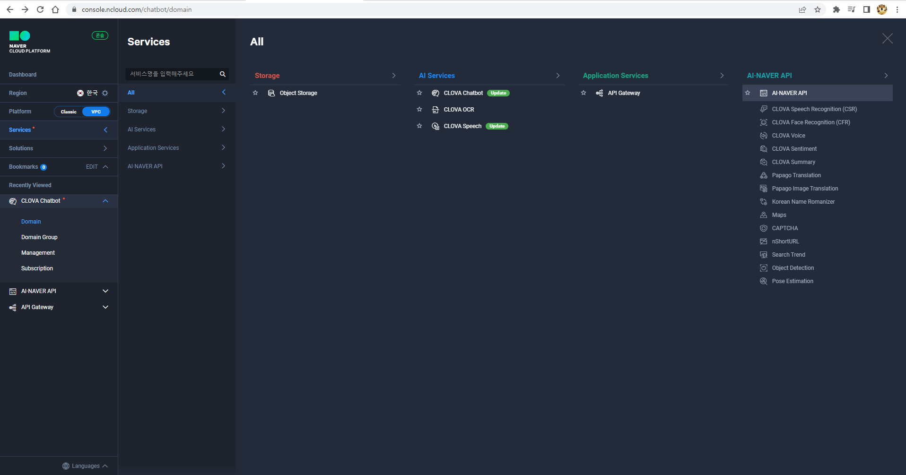
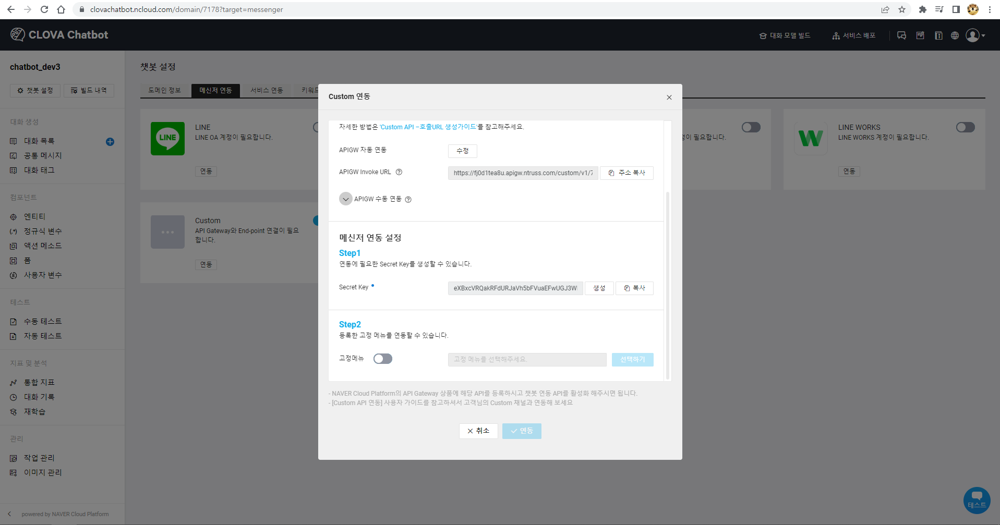

## [01] API Gateway 서비스 신청
\- API Gateway를 통해 API 호출과 관련된 모든 작업들을 편리하게 진행할 수 있습니다.
\- API를 안정적으로 실행하기 위한 다양한 관리 기능들과 API 사용 현황을 실시간으로
 확인할 수 있는 대시보드를 제공합니다.
\- 이를 통해 고객은 보다 효율적으로 비즈니스에 집중할 수 있습니다.
\- https://www.ncloud.com/nsa/kdtai15
\- ID: tutor
\- PW: multi1019! -> 변경하여 사용

### 1. 안정적인 API 호출을 돕는 다양한 관리 기능과 모니터링 대시보드를 제공
 \- 콘솔 -> Service -> Application Services -> API Gateway (이미 생성되어 있음)


### 2. 서비스 이용 신청

### 3. 상품 이용 신청

### 4. 신청 완료


## [02] Clova Chatbot 서비스 신청

### 1. https://www.ncloud.com/nsa/kdtai15 접속

### 2. 서비스 신청

### 3. 도메인 신청
  \- 하나의 도메인은 채팅 로봇을 나타냄.

### 4. 도메인 생성

### 5. 빌더 실행하기

### 6. 메신저 연동: Spring Boot 연동은 Custom 지정

### 7. 연동

### 8. 자동 연동

### 9. 확인

### 10. Spring Boot에서 사용할 APIGW Invoke URL이 생성 되었음.

### 11. Spring Boot에서 사용할 Secret Key 생성


### 12. 연동

### 13. API Gateway에 자동 등록됨.


## [01] Application 등록

### 1. Products & Services

### 2. AI.NAVER API




### 3. Application 등록

### 4. 아래와같이 체크(Application 이름 : chatbotdev)


### 5. 도메인을 사용하지 않음으로 'http://localhost'로 등록, 포트는 필요없음.


### 6. 정상등록


### 7. 인증 정보 확인


---


##  [01] 대화 만들기

### 1. 콘솔

###  2. CLOVA Chatbot

### 3. 빌더 실행하기


### 4. 빌더가 실행된 화면


### 5. Built in 템플릿 
\- builtin_template_하고 있는일 -> 자세히 보기


### 6. 이미 등록된 템플릿 중 선택


### 7. 넌 어느 나라 가봤어 질문 선택


- 기타 대화를 조회하면서 패턴을 확인


---


## [01] Spring boot + WebSocket을 이용한 채팅의 구현

### 1. 프로젝트 생성


### 3. /src/main/resources/application.properties 설정
\- 프로젝트에서 사용되는 오라클 계정 설정

```properties
# JSP View path
spring.mvc.view.prefix=/WEB-INF/views/
spring.mvc.view.suffix=.jsp

# DEVTOOLS (DevToolsProperties)
spring.devtools.livereload.enabled=true
```

### 4. jsp 사용을위한 의존성 추가
1) build.gradle 수정 추가

```java
    implementation 'javax.servlet:jstl'
    implementation 'org.apache.tomcat.embed:tomcat-embed-jasper'
```

### 5. Socket을 처리할 핸들러 구현, 채팅 처리 클래스

SocketHandler.java 생성

```java
package dev.mvc.chatting;

import java.util.HashMap;

import org.springframework.stereotype.Component;
import org.springframework.web.socket.CloseStatus;
import org.springframework.web.socket.TextMessage;
import org.springframework.web.socket.WebSocketSession;
import org.springframework.web.socket.handler.TextWebSocketHandler;

@Component
public class SocketHandler extends TextWebSocketHandler {
    
    HashMap<String, WebSocketSession> sessionMap = new HashMap<>(); //웹소켓 세션을 담아둘 맵
    
    @Override
    public void handleTextMessage(WebSocketSession session, TextMessage message) {
        // 메시지 발송, key는 난수 형태로 부여됨.
        String msg = message.getPayload();
        for(String key : sessionMap.keySet()) {
            System.out.println("메시지 발송 key: " + key);
            WebSocketSession wss = sessionMap.get(key);
            try {
                wss.sendMessage(new TextMessage(msg));
            }catch(Exception e) {
                e.printStackTrace();
            }
        }
    }
    
    @Override
    public void afterConnectionEstablished(WebSocketSession session) throws Exception {
        // 소켓 연결
        super.afterConnectionEstablished(session);
        sessionMap.put(session.getId(), session); // id는 난수 형태로 부여되며 메시지 전송시 key로 이용됨
        System.out.println("소켓 연결 session.getId(): " + session.getId());
    }
    
    @Override
    public void afterConnectionClosed(WebSocketSession session, CloseStatus status) throws Exception {
        // 소켓 종료
        System.out.println("소켓 종료 session.getId(): " + session.getId()); // id는 난수 형태로 부여되며 메시지 전송시 key로 이용됨
        sessionMap.remove(session.getId());
        super.afterConnectionClosed(session, status);
    }
}
```


### 6. Socket을 처리할 핸들러 등록

WebSocketConfig.java 생성

```java
package dev.mvc.chatting;

import org.springframework.beans.factory.annotation.Autowired;
import org.springframework.context.annotation.Configuration;
import org.springframework.web.socket.config.annotation.EnableWebSocket;
import org.springframework.web.socket.config.annotation.WebSocketConfigurer;
import org.springframework.web.socket.config.annotation.WebSocketHandlerRegistry;

/**
 * 채팅 핸들러(처리자) 등록
 * @author stu
 *
 */
@Configuration
@EnableWebSocket
public class WebSocketConfig implements WebSocketConfigurer{

    @Autowired
    SocketHandler socketHandler;
    
    @Override
    public void registerWebSocketHandlers(WebSocketHandlerRegistry registry) {
        registry.addHandler(socketHandler, "/chat");  // JSP에서 이용하는 접속 주소: ws://localhost:9092/chat
    }
}
```

### 7. 채팅Controller

ChattingCont.java 생성

```java
package dev.mvc.chatting;

import org.springframework.stereotype.Controller;
import org.springframework.web.bind.annotation.RequestMapping;
import org.springframework.web.servlet.ModelAndView;

@Controller
public class ChattingCont {
    @RequestMapping("/chatting")  // http://localhost:9092/chatting
    public ModelAndView chat() {
        ModelAndView mav = new ModelAndView();
        mav.setViewName("chatting"); // /src/main/webapp/WEB-INF/views/chatting.jsp
        
        return mav;
    }
}
```

아래 코드와 같다.


### 8. JSP View

/src/main/webapp/WEB-INF/views/chatting.jsp 생성

```jsp
<%@ page contentType="text/html; charset=UTF-8" %>
<%@ taglib prefix="c" uri="http://java.sun.com/jsp/jstl/core" %>
<%@ taglib prefix="fmt" uri="http://java.sun.com/jsp/jstl/fmt" %>
 
<!DOCTYPE html>
<html lang="ko">
<head>
<meta charset="UTF-8">
<title>http://localhost:9092/chatting</title>

<script type="text/JavaScript"
          src="http://ajax.googleapis.com/ajax/libs/jquery/3.4.1/jquery.min.js"></script>

<style type="text/css">
        *{
            margin:0;
            padding:0;
        }
        .container {
            width: 500px;
            margin: 0 auto;
            padding: 25px
        }
        .container h1{
            text-align: left;
            padding: 5px 5px 5px 15px;
            color: #FFBB00;
            border-left: 3px solid #4C82E3;
            margin-bottom: 20px;
        }
        .chatting_pannel {
            background-color: #000;
            width: 500px;
            height: 400px;
            overflow: auto;
        }
        .chatting_pannel p{
            color: #fff;
            text-align: left;
        }
        input {
            width: 330px;
            height: 25px;
        }
        #yourMsg {
            display: none;
        }
        
</style>

<script type="text/javascript">
var ws;

$(function() {
    // 키이벤트 처리
    $('#userName').on('keydown', function(key) {
      if (key.keyCode == 13) { // Enter
        // $('#rname').focus();
        chatName(); // 사용자명 입력 Layer를 닫고 메시지 Layer로 변경됨.
      }  
    });  
})

// alert(location.host); // localhost:9092
function wsOpen(){
    ws = new WebSocket("ws://" + location.host + "/chat"); // ws://localhost:9092/chat
    wsEvt();
}
    
function wsEvt() {
    ws.onopen = function(data){
        //소켓이 열리면 초기화 세팅하기
      $('#chatting').focus();
    }
    
    ws.onmessage = function(data) {
        var msg = data.data;
        if(msg != null && msg.trim() != ''){
            $("#chatting_pannel").append("<p>" + msg + "</p>");
        }
    }

    document.addEventListener("keypress", function(e){
        if(e.keyCode == 13){ //enter press
            send();
        }
    });
}

function chatName(){
    var userName = $("#userName").val();
    if(userName == null || userName.trim() == ""){
        alert("사용자 이름을 입력해주세요.");
        $("#userName").focus();
    }else{
        wsOpen();
        $("#yourName").hide();
        $("#yourMsg").show();
    }
}

function send() {
    var uN = $("#userName").val();
    var msg = $("#chatting").val();
    ws.send(uN+" : "+msg);
    $('#chatting').val("");
}
</script>

</head>
<body>
    <div id="container" class="container">
        <h1>실시간 문의</h1>
        <div id="chatting_pannel" class="chatting_pannel">
        </div>
        
        <div id="yourName">
            <table class="inputTable">
                <tr>
                    <th>사용자명</th>
                    <th><input type="text" name="userName" id="userName"></th>
                    <th><button onclick="chatName()" id="startBtn">이름 등록</button></th>
                </tr>
            </table>
        </div>
        
        <div id="yourMsg">
            <table class="inputTable">
                <tr>
                    <th>메시지</th>
                    <th><input id="chatting" placeholder="보내실 메시지를 입력하세요."></th>
                    <th><button onclick="send()" id="sendBtn">보내기</button></th>
                </tr>
            </table>
        </div>
    </div>
</body>
</html>
```


### 10. 로그인 화면


### 11. 연결이 완료된 화면

사용자명을 입력하면 소켓이 연결된다.


### 12. 메시지 발송화면


### 13. 윈도우창을 새로고침하거나 닫으면 소켓이 종료됨.


---


## [01] 대화 만들기
\- https://console.ncloud.com/chatbot/domain


### 1. 콘솔

### 2. CLOVA Chatbot

### 3. 빌더 실행하기

### 4. 대화 목록


### 5. 대화 등록 화면


### 6. 대화 이름: (Java, JSP, Spring Boot, Python )기술 안내, 대화 태그: 개발 가이드

(1) 질문 등록: JAVA에 대해서 알려주세요.
  답변: 전자정부 구축 및 기업 전산화에 표준적으로 쓰이는 웹 어플리케이션 개발 언어입니다. 
  URL 주소: http://www.oracle.com     

(2) 질문 등록: JSP에 대해서 알려주세요.
  답변: 웹 어플리케이션 구축시 사용자 화면을 제작하는 분야에 주로 쓰입니다.
  URL 주소: http://www.oracle.com     

(3) 질문 등록: Spring Boot란?
  답변: 대규모 웹 어플리케이션 구축시 사용되는 기술로 MCV에 기반하고 있습니다.
  URL 주소: http://www.spring.io

(4) Python이란?
  답변: 데이터 분석 및 머신러닝, 딥러닝, 사물인터넷에 최적화된 언어입니다.
  URL 주소: http://www.python.org

\- 질문 등록 화면


### 7. 대화 모델 빌드


### 8. 빌드 성공 확인 및 테스트


### 9. 바로시작


### 10. 정상적으로 출력


### 11. 서비스 배포하기


---


## [01] Spring boot + WebSocket을 이용한 채팅의 구현
### 1. 프로젝트 생성


### 2. /src/main/resources/application.properties 설정

```properties
server.port = 9093

# JSP View path
spring.mvc.view.prefix=/WEB-INF/views/
spring.mvc.view.suffix=.jsp

# DEVTOOLS (DevToolsProperties)
spring.devtools.livereload.enabled=true
```

### 3. jsp, JSON 사용을위한 의존성 추가

1) build.gradle 수정 추가

```java
       implementation 'javax.servlet:jstl'
       implementation 'org.apache.tomcat.embed:tomcat-embed-jasper'
       // https://mvnrepository.com/artifact/com.googlecode.json-simple/json-simple
       implementation 'com.googlecode.json-simple:json-simple:1.1.1'
```

### 4. 웹 소켓을 사용하기 위해 설정
 WebSocketConfig.java 생성

```java
package dev.mvc.naver_chatting;

import org.springframework.context.annotation.Configuration;
import org.springframework.messaging.simp.config.MessageBrokerRegistry;
import org.springframework.web.socket.config.annotation.EnableWebSocketMessageBroker;
import org.springframework.web.socket.config.annotation.StompEndpointRegistry;
import org.springframework.web.socket.config.annotation.WebSocketMessageBrokerConfigurer;

@Configuration
@EnableWebSocketMessageBroker
public class WebSocketConfig implements WebSocketMessageBrokerConfigurer {

    @Override
    public void registerStompEndpoints(StompEndpointRegistry registry) {
        registry.addEndpoint("/ws").withSockJS(); // 웹 소켓을 사용하기 위해 설정하는 부분
    }

    @Override
    public void configureMessageBroker(MessageBrokerRegistry registry) {
        registry.setApplicationDestinationPrefixes("/app"); //prefix 설정
        registry.enableSimpleBroker("/topic"); //topic 이라는 주제에 브로커를 설정
    }
}

```

### 5. 채팅Controller
ChatCont.java 생성

```java
package dev.mvc.naver_chatting;

import org.apache.tomcat.util.codec.binary.Base64;
import org.json.simple.JSONArray;
import org.json.simple.JSONObject;
import org.json.simple.parser.JSONParser;
import org.springframework.messaging.handler.annotation.MessageMapping;
import org.springframework.messaging.handler.annotation.Payload;
import org.springframework.messaging.handler.annotation.SendTo;
import org.springframework.stereotype.Controller;
import org.springframework.web.bind.annotation.RequestMapping;
import org.springframework.web.servlet.ModelAndView;

import javax.crypto.Mac;
import javax.crypto.spec.SecretKeySpec;
import java.io.BufferedReader;
import java.io.DataOutputStream;
import java.io.IOException;
import java.io.InputStreamReader;
import java.net.HttpURLConnection;
import java.net.URL;
import java.util.Date;

@Controller
public class ChatCont {

    // 시크릿 키
    private static String secretKey = "ZVpKSlJiYldkYUdZVHNzZUZZVlZoUlZqeWdRdEVTRVU=";
    // APIGW Invoe URL , 관련 Exception: 
    private static String apiUrl = "https://53cecad6a9b048d5ab8434706e6bfd30.apigw.ntruss.com/custom/v1/5620/8729fb4f9110829d9795af04307798753a1501ce56719e2b94c3c5d7ca5c43f1";
    @RequestMapping("/naver_chatting")  // http://localhost:9093/naver_chatting
    public ModelAndView chat() {
        ModelAndView mav = new ModelAndView();
        mav.setViewName("naver_chatting"); // /src/main/webapp/WEB-INF/views/naver_chatting.jsp
        
        return mav;
    }
    
    @MessageMapping("/sendMessage")
    @SendTo("/topic/public")
    public String sendMessage(@Payload String chatMessage) throws IOException {

        URL url = new URL(apiUrl);

        String message =  getReqMessage(chatMessage);
        String encodeBase64String = makeSignature(message, secretKey);

        //api서버 접속 (서버 -> 서버 통신)        
        HttpURLConnection con = (HttpURLConnection)url.openConnection();
        con.setRequestMethod("POST");
        con.setRequestProperty("Content-Type", "application/json;UTF-8");
        con.setRequestProperty("X-NCP-CHATBOT_SIGNATURE", encodeBase64String);

        con.setDoOutput(true);
        DataOutputStream wr = new DataOutputStream(con.getOutputStream());

        wr.write(message.getBytes("UTF-8"));
        wr.flush();
        wr.close();
        int responseCode = con.getResponseCode();

        BufferedReader br;

        if(responseCode==200) { // 정상 호출

            BufferedReader in = new BufferedReader(
                    new InputStreamReader(
                            con.getInputStream(), "UTF-8"));
            String decodedString;
            String jsonString = "";
            while ((decodedString = in.readLine()) != null) {
                jsonString = decodedString;
            }
            
            // 받아온 값을 세팅하는 부분
            JSONParser jsonparser = new JSONParser();
            try {
                JSONObject json = (JSONObject)jsonparser.parse(jsonString);
                JSONArray bubblesArray = (JSONArray)json.get("bubbles");
                JSONObject bubbles = (JSONObject)bubblesArray.get(0);
                JSONObject data = (JSONObject)bubbles.get("data");
                String description = "";
                description = (String)data.get("description");
                chatMessage = description;
            } catch (Exception e) {
                System.out.println("error");
                e.printStackTrace();
            }

            in.close();
        } else {  // 에러 발생
            chatMessage = con.getResponseMessage();
        }
        return chatMessage;
    }

    //보낼 메세지를 네이버에서 제공해준 암호화로 변경해주는 메소드
    public static String makeSignature(String message, String secretKey) {

        String encodeBase64String = "";

        try {
            byte[] secrete_key_bytes = secretKey.getBytes("UTF-8");

            SecretKeySpec signingKey = new SecretKeySpec(secrete_key_bytes, "HmacSHA256");
            Mac mac = Mac.getInstance("HmacSHA256");
            mac.init(signingKey);

            byte[] rawHmac = mac.doFinal(message.getBytes("UTF-8"));
            encodeBase64String = Base64.encodeBase64String(rawHmac);

            return encodeBase64String;

        } catch (Exception e){
            System.out.println(e);
        }

        return encodeBase64String;

    }

    // 보낼 메세지를 네이버 챗봇에 포맷으로 변경해주는 메소드
    public static String getReqMessage(String voiceMessage) {

        String requestBody = "";

        try {

            JSONObject obj = new JSONObject();

            long timestamp = new Date().getTime();

            System.out.println("##"+timestamp);

            obj.put("version", "v2");
            obj.put("userId", "U47b00b58c90f8e47428af8b7bddcda3d"); // 봇과 채팅하는 사용자의 고유 ID로 최대 256자를 넘지 않아야 합니다. 사용자마다 고유한 userId를 설정하십시오.
            obj.put("timestamp", timestamp);

            JSONObject bubbles_obj = new JSONObject();

            bubbles_obj.put("type", "text");

            JSONObject data_obj = new JSONObject();
            data_obj.put("description", voiceMessage);

            bubbles_obj.put("type", "text");
            bubbles_obj.put("data", data_obj);

            JSONArray bubbles_array = new JSONArray();
            bubbles_array.add(bubbles_obj);

            obj.put("bubbles", bubbles_array);
            obj.put("event", "send");

            requestBody = obj.toString();

        } catch (Exception e){
            System.out.println("## Exception : " + e);
        }

        return requestBody;

    }
}
```

###  6. Stom javascript 다운로드
  \- Naver에서 브러우저 바로 접속을 지원하지 않음으로 Spring Boot을통해서 연결해야함
  \- Stom은 스프링부트와 자바스크립트의 통신을 편리하게 구축하도록 자동화 지원

1) stomp : https://github.com/jmesnil/stomp-websocket/releases 

2) /stomp-websocket-2.3.4/lib/stomp.min.js -> 복사 -> STS -> /static/js


### 7. sockjs javascript 다운로드
  \- Desktop 및 모바일 환경에서의 Websocket 지원 js

1) sockjs : https://github.com/sockjs/sockjs-client/releases
2) /sockjs-client-1.5.2/dist/sockjs.min.js-> 복사 -> STS -> /static/js


/static/js/app.js 생성

```js
var stompClient = null;

function setConnected(connected) {
    $("#connect").prop("disabled", connected);
    $("#disconnect").prop("disabled", !connected);
    $("#send").prop("disabled", !connected);
    if (connected) {
        $("#conversation").show();
    }
    else {
        $("#conversation").hide();
    }
    $("#msg").html("");
}

function connect() {
    var socket = new SockJS('/ws');
    stompClient = Stomp.over(socket);
    stompClient.connect({}, function (frame) {
        setConnected(true);
        console.log('Connected: ' + frame);
        stompClient.subscribe('/topic/public', function (message) {
            showMessage("받은 메시지: " + message.body); // 서버에 메시지 전달 후 리턴받는 메시지
        });
    });
}

function disconnect() {
    if (stompClient !== null) {
        stompClient.disconnect();
    }
    setConnected(false);
    console.log("Disconnected");
}

function sendMessage() {
    let message = $("#msg").val()
    showMessage("보낸 메시지: " + message);

    stompClient.send("/app/sendMessage", {}, JSON.stringify(message)); // 서버에 보낼 메시지
}

function showMessage(message) {
    $("#communicate").append("<tr><td>" + message + "</td></tr>");
}

$(function () {
    $("form").on('submit', function (e) {
        e.preventDefault();
    });
    $( "#connect" ).click(function() { connect(); });
    $( "#disconnect" ).click(function() { disconnect(); });
    $( "#send" ).click(function() { sendMessage(); });
});


```

/static/css/style.css 생성

```css
body {
    background-color: #f5f5f5;
}

#main-content {
    max-width: 940px;
    padding: 2em 3em;
    margin: 0 auto 20px;
    background-color: #fff;
    border: 1px solid #e5e5e5;
    -webkit-border-radius: 5px;
    -moz-border-radius: 5px;
    border-radius: 5px;
}


```


### 8. JSP View

 /src/main/webapp/WEB-INF/views/naver_chatting.jsp

```jsp
<%@ page contentType="text/html; charset=UTF-8" %>
<%@ taglib prefix="c" uri="http://java.sun.com/jsp/jstl/core" %>
<%@ taglib prefix="fmt" uri="http://java.sun.com/jsp/jstl/fmt" %>
 
<!DOCTYPE html>
<html lang="ko">
<head>
<meta charset="UTF-8">
<meta name="viewport" content="user-scalable=yes, initial-scale=1.0, maximum-scale=3.0, width=device-width" /> 
<title>http://localhost:9093/naver_chatting</title>
<link href="/css/style.css" rel="Stylesheet" type="text/css">  <%--/static 폴더 기준 --%>

<script type="text/JavaScript"
          src="http://ajax.googleapis.com/ajax/libs/jquery/3.4.1/jquery.min.js"></script>

<link rel="stylesheet" href="https://maxcdn.bootstrapcdn.com/bootstrap/3.4.1/css/bootstrap.min.css">
<script src="https://maxcdn.bootstrapcdn.com/bootstrap/3.4.1/js/bootstrap.min.js"></script>

<%-- WebSocket 관련 설정 --%>
<script src="/js/sockjs.min.js"></script>  <%--/static 폴더 기준 --%>
<script src="/js/stomp.min.js"></script>  <%--/static 폴더 기준 --%>

<script type="text/JavaScript" src="/js/app.js"></script>  <%--/static 폴더 기준 --%>
          
</head>
<body>
<div id="main-content" class="container">
    <H2>개발 가이드</H2>
            <form class="form-inline">
                <div class="form-group">
                    <label for="connect">웹소켓 연결:</label>
                    <button id="connect" class="btn btn-default" type="submit">연결</button>
                    <button id="disconnect" class="btn btn-default" type="submit" disabled="disabled">해제</button>
                </div>
            </form>
            <form class="form-inline">
                <div class="form-group" style="width: 90%;">
                    <label for="msg">문의</label>
                    <input type="text" id="msg" class="form-control" placeholder="내용을 입력하세요...." value="JAVA에 대해서 알려주세요."  style="width:90%;">
                </div>
                <button id="send" class="btn btn-default" disabled type="submit">보내기</button>
            </form>


    <div class="row">
        <div class="col-md-12">
            <table id="conversation" class="table table-striped">
                <thead>
                <tr>
                    <th>메세지</th>
                </tr>
                </thead>
                <tbody id="communicate">
                </tbody>
            </table>
        </div>
    </div>
</div>
</body>
</html>
```


### 9. 개발가이드 화면


---


## [01] Naver Clova 음성 인식 AI API활용
\- 문자 -> 음성, 음성 -> 문자로 변환을 제공하는 사이트   
\- 최대 100자까지 지원되며, 한글은 50자 까지만 지원됨.  
\- https://soundoftext.com/

### 1. 문자 -> 음성

### 2. Play확인 및 sample.mp3로 다운로드


### 3. Naver Cloud
https://console.ncloud.com/naver-service/application


dev.mvc.csr/Main.java 생성

```java
package dev.mvc.csr;
import java.io.*;
import java.net.HttpURLConnection;
import java.net.URL;

public class Main {

    public static void main(String[] args) {
        String clientId = "YOUR_CLIENT_ID";             // Application Client ID";
        String clientSecret = "YOUR_CLIENT_SECRET";     // Application Client Secret";

        try {
            String imgFile = "음성 파일 경로";
            File voiceFile = new File(imgFile);

            String language = "Kor";        // 언어 코드 ( Kor, Jpn, Eng, Chn )
            String apiURL = "https://naveropenapi.apigw.ntruss.com/recog/v1/stt?lang=" + language;
            URL url = new URL(apiURL);

            HttpURLConnection conn = (HttpURLConnection)url.openConnection();
            conn.setUseCaches(false);
            conn.setDoOutput(true);
            conn.setDoInput(true);
            conn.setRequestProperty("Content-Type", "application/octet-stream");
            conn.setRequestProperty("X-NCP-APIGW-API-KEY-ID", clientId);
            conn.setRequestProperty("X-NCP-APIGW-API-KEY", clientSecret);

            OutputStream outputStream = conn.getOutputStream();
            FileInputStream inputStream = new FileInputStream(voiceFile);
            byte[] buffer = new byte[4096];
            int bytesRead = -1;
            while ((bytesRead = inputStream.read(buffer)) != -1) {
                outputStream.write(buffer, 0, bytesRead);
            }
            outputStream.flush();
            inputStream.close();
            BufferedReader br = null;
            int responseCode = conn.getResponseCode();
            if(responseCode == 200) { // 정상 호출
                br = new BufferedReader(new InputStreamReader(conn.getInputStream()));
            } else {  // 오류 발생
                System.out.println("error!!!!!!! responseCode= " + responseCode);
                br = new BufferedReader(new InputStreamReader(conn.getInputStream()));
            }
            String inputLine;

            if(br != null) {
                StringBuffer response = new StringBuffer();
                while ((inputLine = br.readLine()) != null) {
                    response.append(inputLine);
                }
                br.close();
                System.out.println(response.toString());
            } else {
                System.out.println("error !!!");
            }
        } catch (Exception e) {
            System.out.println(e);
        }
    }
}
```

ID /  Secret / 파일 경로 복사 붙여넣기


```java
        String clientId = "d2ozcprs3u";             // Application Client ID";
        String clientSecret = "RuV2mbef0T99855rHsoR7VlaD8dlpQOZXGqZmtRK";     // Application Client Secret";

        try {
            String imgFile = "C:\\aistudy\\ncloud\\csr\\hi.mp3";
```


---


연동 확인



```java
    private static String secretKey = "eXBxcVRQakRFdURJaVh5bFVuaEFwUGJ3WlRsbHlFaHo=";
    // APIGW Invoe URL , 관련 Exception: 
    private static String apiUrl = "https://fj0d1tea8u.apigw.ntruss.com/custom/v1/7178/f6d601264c5c7aa83b7190e73c1c4019c50ddb9479133e69a8487c7007e0ffa5";
```


---

새 프로젝트 생성


com.study.csr/Main.java 생성

```java
import java.io.*;
import java.net.HttpURLConnection;
import java.net.URL;

public class Main {

    public static void main(String[] args) {
        String clientId = "YOUR_CLIENT_ID";             // Application Client ID";
        String clientSecret = "YOUR_CLIENT_SECRET";     // Application Client Secret";

        try {
            String imgFile = "음성 파일 경로";
            File voiceFile = new File(imgFile);

            String language = "Kor";        // 언어 코드 ( Kor, Jpn, Eng, Chn )
            String apiURL = "https://naveropenapi.apigw.ntruss.com/recog/v1/stt?lang=" + language;
            URL url = new URL(apiURL);

            HttpURLConnection conn = (HttpURLConnection)url.openConnection();
            conn.setUseCaches(false);
            conn.setDoOutput(true);
            conn.setDoInput(true);
            conn.setRequestProperty("Content-Type", "application/octet-stream");
            conn.setRequestProperty("X-NCP-APIGW-API-KEY-ID", clientId);
            conn.setRequestProperty("X-NCP-APIGW-API-KEY", clientSecret);

            OutputStream outputStream = conn.getOutputStream();
            FileInputStream inputStream = new FileInputStream(voiceFile);
            byte[] buffer = new byte[4096];
            int bytesRead = -1;
            while ((bytesRead = inputStream.read(buffer)) != -1) {
                outputStream.write(buffer, 0, bytesRead);
            }
            outputStream.flush();
            inputStream.close();
            BufferedReader br = null;
            int responseCode = conn.getResponseCode();
            if(responseCode == 200) { // 정상 호출
                br = new BufferedReader(new InputStreamReader(conn.getInputStream()));
            } else {  // 오류 발생
                System.out.println("error!!!!!!! responseCode= " + responseCode);
                br = new BufferedReader(new InputStreamReader(conn.getInputStream()));
            }
            String inputLine;

            if(br != null) {
                StringBuffer response = new StringBuffer();
                while ((inputLine = br.readLine()) != null) {
                    response.append(inputLine);
                }
                br.close();
                System.out.println(response.toString());
            } else {
                System.out.println("error !!!");
            }
        } catch (Exception e) {
            System.out.println(e);
        }
    }
}
```

```java
    public static void main(String[] args) {
        String clientId = "d2ozcprs3u";             // Application Client ID";
        String clientSecret = "RuV2mbef0T99855rHsoR7VlaD8dlpQOZXGqZmtRK";     // Application Client Secret";

        try {
            String imgFile = "C:\\aistudy\\ncloud\\csr\\hi2.mp3";
```


---


## [01] Naver Clova OCR(Optical character recognition)
\- 문서를 인식하고, 사용자가 지정한 영역의 텍스트와 데이터를 정확하게 추출한다.
\- 100건까지 무료, 300건의 경우 600원의 이용 요금 부과됨


(1) 도메인 생성
 \- 도메인이름, 도메인코드 자유롭게 설정가능, 인식언어 한국어, 
  서비스 타입은 General

 \- General 도메인 : 입력 이미지에서 텍스트만 추출하는 Text OCR

 \- Template 도메인: 입력 이미지에서 판독할 영역을 직접 지정해 영역에 포함된
  텍스트만 추출


(2) CLOVA OCR 서비스 Invoke URL 설정

 \- InvokeURL은 안전한 서비스를 위해 외부 서비스에 바로 공개되지 않는다.
 \- 보안 및 서비스 처리 수준을 높이기 위해서 API Gateway 상품에 연동하여 사용하도록 설계되어 있다.
 \- 서비스 처리 흐름 : 도메인의 OCR InvokeURL 확인 → API Gateway의 Endpoint로 연결 → 외부 연동
 \- 도메인의 OCR InvokeURL로 API Gateway와 연동을 진행하기 위해서는 먼저 콘솔에 접속하여
  API Gateway 상품 이용을 신청해야 한다.
 \- 참고 : https://guide.ncloud-docs.com/docs/apigw-apigw-2-1

 \- https://www.ncloud.com/ 메인 페이지 접속 -> 서비스 -> API Gateway


(3) Secret Key 생성 -> APIGW 자동 연동
 \- SecretKey Java/Python에서 사용할 것임으로 복사하여 보관


### 2. API 테스트
(1) Java 테스트
\- JSON 객체를 사용
\- https://github.com/stleary/JSON-java 에서
 아래의 'Click here if you just want the latest release jar file.' 부분 클릭 하여
 jar 파일을 aistudy/lib 폴더에 다운로드한다.


ocr/OCRGeneralAPIDemo.java 생성

```java
package ocr;
import java.io.BufferedReader;
import java.io.DataOutputStream;
import java.io.File;
import java.io.FileInputStream;
import java.io.IOException;
import java.io.InputStreamReader;
import java.io.OutputStream;
import java.net.HttpURLConnection;
import java.net.URL;
import java.util.UUID;
 
import org.json.JSONArray;
import org.json.JSONObject;
 
public class OCRGeneralAPIDemo {
 
        public static void main(String[] args) {
                String apiURL = ";
                String secretKey = "";
                String imageFile = "C:\\aistudy\\sample1.jpg";
 
                try {
                        URL url = new URL(apiURL);
                        HttpURLConnection con = (HttpURLConnection)url.openConnection();
                        con.setUseCaches(false);
                        con.setDoInput(true);
                        con.setDoOutput(true);
                        con.setReadTimeout(30000);
                        con.setRequestMethod("POST");
                        String boundary = "----" + UUID.randomUUID().toString().replaceAll("-", "");
                        con.setRequestProperty("Content-Type", "multipart/form-data; boundary=" + boundary);
                        con.setRequestProperty("X-OCR-SECRET", secretKey);
 
                        JSONObject json = new JSONObject();
                        json.put("version", "V2");
                        json.put("requestId", UUID.randomUUID().toString());
                        json.put("timestamp", System.currentTimeMillis());
                        JSONObject image = new JSONObject();
                        image.put("format", "jpg");
                        image.put("name", "demo");
                        JSONArray images = new JSONArray();
                        images.put(image);
                        json.put("images", images);
                        String postParams = json.toString();
 
                        con.connect();
                        DataOutputStream wr = new DataOutputStream(con.getOutputStream());
                        long start = System.currentTimeMillis();
                        File file = new File(imageFile);
                        writeMultiPart(wr, postParams, file, boundary);
                        wr.close();
 
                        int responseCode = con.getResponseCode();
                        BufferedReader br;
                        if (responseCode == 200) {
                                br = new BufferedReader(new InputStreamReader(con.getInputStream()));
                        } else {
                                br = new BufferedReader(new InputStreamReader(con.getErrorStream()));
                        }
                        String inputLine;
                        StringBuffer response = new StringBuffer();
                        while ((inputLine = br.readLine()) != null) {
                                response.append(inputLine);
                        }
                        br.close();
                        //System.out.println(response); 문자열
                
                        //String to Json Object
                        JSONObject jsonObj = new JSONObject(response.toString());
                        //System.out.println(jsonObj); https://jsonbeautifier.org/ 에서 확인
                        JSONArray jsonArr = (JSONArray)jsonObj.get("images");
                //System.out.println(jsonArr); https://jsonbeautifier.org/ 에서 확인
                        JSONObject jsonObj2 = (JSONObject)jsonArr.get(0);
                //System.out.println(jsonObj2); https://jsonbeautifier.org/ 에서 확인
                        JSONArray jsonArr2 = (JSONArray)jsonObj2.get("fields");
                //System.out.println(jsonArr2); https://jsonbeautifier.org/ 에서 확인
      System.out.println(" 단어 수 : "+jsonArr2.length());//단어수
      StringBuffer sb = new StringBuffer();
      for(int i= 0 ; i<jsonArr2.length(); i++) {
        sb.append(" "+jsonArr2.getJSONObject(i).get("inferText"));
        if(i==1) {sb.append("\n");}
        
      }
      System.out.println(sb);
                                        
                } catch (Exception e) {
                        System.out.println(e);
                }
        }
        
        private static void writeMultiPart(OutputStream out, String jsonMessage, File file, String boundary) throws
                IOException {
                StringBuilder sb = new StringBuilder();
                sb.append("--").append(boundary).append("\r\n");
                sb.append("Content-Disposition:form-data; name=\"message\"\r\n\r\n");
                sb.append(jsonMessage);
                sb.append("\r\n");
 
                out.write(sb.toString().getBytes("UTF-8"));
                out.flush();
 
                if (file != null && file.isFile()) {
                        out.write(("--" + boundary + "\r\n").getBytes("UTF-8"));
                        StringBuilder fileString = new StringBuilder();
                        fileString
                                .append("Content-Disposition:form-data; name=\"file\"; filename=");
                        fileString.append("\"" + file.getName() + "\"\r\n");
                        fileString.append("Content-Type: application/octet-stream\r\n\r\n");
                        out.write(fileString.toString().getBytes("UTF-8"));
                        out.flush();
 
                        try (FileInputStream fis = new FileInputStream(file)) {
                                byte[] buffer = new byte[8192];
                                int count;
                                while ((count = fis.read(buffer)) != -1) {
                                        out.write(buffer, 0, count);
                                }
                                out.write("\r\n".getBytes());
                        }
 
                        out.write(("--" + boundary + "--\r\n").getBytes("UTF-8"));
                }
                out.flush();
        }
}
```

url 변경

```java
                String apiURL = "https://aebb11c320dd4cfca45990eca440b43f.apigw.ntruss.com/custom/v1/16868/c1b11ceb20a968c68e4c079f08c85bda0fbb499282e53e6e81798008e8392b05/general";
                String secretKey = "T3BsdExzYk9ld1ZLcGFoTGNxY2VMa2thZ1V5VFdTUnU=";
                String imageFile = "C:\\aistudy\\ncloud\\OCR\\sample1.jpg";
```


---


## [01] Naver Clova 이미지 인식 AI API 활용(CFR)

\- Clova Face Recognition API(이하 CFR API)는 이미지 데이터를 입력받은 후 얼굴 인식
 결과를 JSON 형태로 반환한다.

\- CFR API는 이미지에 있는 얼굴 인식하여 분석 정보를 제공하는 얼굴 감지 API와 닮은
 연예인을 알려주는 유명인 얼굴 인식 API를 제공

\- CFR API는 HTTP 기반의 REST API이며, 사용자 인증(로그인)이 필요하지 않은 비로그인
 Open API이다.

\- 1 ~ 1000건까지는 1000 원의 요금 부과, 1회만 사용해도 1000원이며, 서비스 이용이
 1000회를 초과하면 1000원 단위로 요금 증가  

\- 공식 문서: https://developers.naver.com/docs/clova/api/CFR/API_Guide.md#%EC%9D%91%EB%8B%B5-2   

\- 국내 유명인 위주로 인식을 잘함.

com.study.cfr/APIExamFace.java 생성

```java
package cfr;
import java.io.*;
import java.net.HttpURLConnection;
import java.net.URL;
import java.net.URLConnection;
 
// 네이버 얼굴인식 API 예제
public class APIExamFace {
 
    public static void main(String[] args) {
 
        StringBuffer reqStr = new StringBuffer();
        String clientId = "YOUR_CLIENT_ID";//애플리케이션 클라이언트 아이디값";
        String clientSecret = "YOUR_CLIENT_SECRET";//애플리케이션 클라이언트 시크릿값";
 
        try {
            String paramName = "image"; // 파라미터명은 image로 지정
            String imgFile = "이미지 파일 경로 ";
            File uploadFile = new File(imgFile);
            String apiURL = "https://naveropenapi.apigw.ntruss.com/vision/v1/celebrity"; // 유명인 얼굴 인식
            //String apiURL = "https://naveropenapi.apigw.ntruss.com/vision/v1/face"; // 얼굴 감지
            URL url = new URL(apiURL);
            HttpURLConnection con = (HttpURLConnection)url.openConnection();
            con.setUseCaches(false);
            con.setDoOutput(true);
            con.setDoInput(true);
            // multipart request
            String boundary = "---" + System.currentTimeMillis() + "---";
            con.setRequestProperty("Content-Type", "multipart/form-data; boundary=" + boundary);
            con.setRequestProperty("X-NCP-APIGW-API-KEY-ID", clientId);
            con.setRequestProperty("X-NCP-APIGW-API-KEY", clientSecret);
            OutputStream outputStream = con.getOutputStream();
            PrintWriter writer = new PrintWriter(new OutputStreamWriter(outputStream, "UTF-8"), true);
            String LINE_FEED = "\r\n";
            // file 추가
            String fileName = uploadFile.getName();
            writer.append("--" + boundary).append(LINE_FEED);
            writer.append("Content-Disposition: form-data; name=\"" + paramName + "\"; filename=\"" + fileName + "\"").append(LINE_FEED);
            writer.append("Content-Type: "  + URLConnection.guessContentTypeFromName(fileName)).append(LINE_FEED);
            writer.append(LINE_FEED);
            writer.flush();
            FileInputStream inputStream = new FileInputStream(uploadFile);
            byte[] buffer = new byte[4096];
            int bytesRead = -1;
            while ((bytesRead = inputStream.read(buffer)) != -1) {
                outputStream.write(buffer, 0, bytesRead);
            }
            outputStream.flush();
            inputStream.close();
            writer.append(LINE_FEED).flush();
            writer.append("--" + boundary + "--").append(LINE_FEED);
            writer.close();
            BufferedReader br = null;
            int responseCode = con.getResponseCode();
            if(responseCode==200) { // 정상 호출
                br = new BufferedReader(new InputStreamReader(con.getInputStream()));
            } else {  // 오류 발생
                System.out.println("error!!!!!!! responseCode= " + responseCode);
                br = new BufferedReader(new InputStreamReader(con.getInputStream()));
            }
            String inputLine;
            if(br != null) {
                StringBuffer response = new StringBuffer();
                while ((inputLine = br.readLine()) != null) {
                    response.append(inputLine);
                }
                br.close();
                //System.out.println(response.toString()); 
                
                //String to Json Object
                JSONObject jsonObj = new JSONObject(response.toString());
                JSONObject jsonObj2 = (JSONObject) jsonObj.get("info"); //https://jsonbeautifier.org/ 에서 확인
                int  facecnt = (int)jsonObj2.get("faceCount");
                System.out.println("발견된 얼굴 수 :"+facecnt);
                
                JSONArray jsonArr = (JSONArray)jsonObj.get("faces");
                
               // System.out.println(jsonArr); //https://jsonbeautifier.org/ 에서 확인
 
                for(int i= 0 ; i<jsonArr.length(); i++) {
                  String name  = jsonArr.getJSONObject(i).getJSONObject("celebrity").get("value").toString();
                  String per = jsonArr.getJSONObject(i).getJSONObject("celebrity").get("confidence").toString();
                  double per2 = Double.parseDouble(per);
                  System.out.printf("감지된 얼굴: %d : %s %7.2f %% \n",(i+1),name,(per2*100));  
                  
               }
 
            } else {
                System.out.println("error !!!");
            }
        } catch (Exception e) {
            System.out.println(e);
        }
    }
}
```


```java
        String clientId = "d2ozcprs3u";//애플리케이션 클라이언트 아이디값";
        String clientSecret = "RuV2mbef0T99855rHsoR7VlaD8dlpQOZXGqZmtRK";//애플리케이션 클라이언트 시크릿값";
 
        try {
            String paramName = "image"; // 파라미터명은 image로 지정
            String imgFile = "C:\\aistudy\\ncloud\\CFR\\image.jpg";
```


----


## [01] Naver Clova 객체 탐지(물체 감지, Object Detection) AI API 활용

 

  \- 공식 문서: https://api.ncloud-docs.com/docs/ai-naver-objectdetection

  \- 이미지 속 객체를 탐지하고 위치 식별을 위한 API
  \- 이미지 속의 탐지된 객체 마다 객체의 이름, 바운딩 박스, 탐지정확률을 제공
   (80종의 객체 탐지로 제한되며, 객체의 크기나 해상도에 따라 인식을 보장하지 않을 수 있다.)
  

  \- 응답 구조

   predictions[0]['detection_classes'] List: 탐지된 객체의 클래스 번호

   predictions[0]['detection_names'] List: 탐지된 객체의 클래스 이름

   predictions[0]['num_detections'] Number: 탐지된 객체의 수

   predictions[0]['detection_boxes'] List<Number, Number, Number, Number>: 탐지된 객체의 바운딩 박스 좌표 (x1, y1, x2, y2)

   predictions[0]['detection_scores'] List: 탐지된 객체의 정확도, 확률값


obj/APIExamObjdet.java 생성

```java
package object;
import java.io.*;
import java.net.HttpURLConnection;
import java.net.URL;
import java.net.URLConnection;
 
import org.json.JSONArray;
import org.json.JSONObject;
 
// Object Detection API 예제
public class APIExamObjdet {
 
    public static void main(String[] args) {
 
        StringBuffer reqStr = new StringBuffer();
        String clientId = "";//애플리케이션 클라이언트 아이디값";
        String clientSecret = "";//애플리케이션 클라이언트 시크릿값";
 
        try {
            String paramName = "image"; // 파라미터명은 image로 지정
            String imgFile = "이미지 경로";
            File uploadFile = new File(imgFile);
            String apiURL = "https://naveropenapi.apigw.ntruss.com/vision-obj/v1/detect"; // 객체 인식
            URL url = new URL(apiURL);
            HttpURLConnection con = (HttpURLConnection)url.openConnection();
            con.setUseCaches(false);
            con.setDoOutput(true);
            con.setDoInput(true);
            // multipart request
            String boundary = "---" + System.currentTimeMillis() + "---";
            con.setRequestProperty("Content-Type", "multipart/form-data; boundary=" + boundary);
            con.setRequestProperty("X-NCP-APIGW-API-KEY-ID", clientId);
            con.setRequestProperty("X-NCP-APIGW-API-KEY", clientSecret);
            OutputStream outputStream = con.getOutputStream();
            PrintWriter writer = new PrintWriter(new OutputStreamWriter(outputStream, "UTF-8"), true);
            String LINE_FEED = "\r\n";
            // file 추가
            String fileName = uploadFile.getName();
            writer.append("--" + boundary).append(LINE_FEED);
            writer.append("Content-Disposition: form-data; name=\"" + paramName + "\"; filename=\"" + fileName + "\"").append(LINE_FEED);
            writer.append("Content-Type: "  + URLConnection.guessContentTypeFromName(fileName)).append(LINE_FEED);
            writer.append(LINE_FEED);
            writer.flush();
            FileInputStream inputStream = new FileInputStream(uploadFile);
            byte[] buffer = new byte[4096];
            int bytesRead = -1;
            while ((bytesRead = inputStream.read(buffer)) != -1) {
                outputStream.write(buffer, 0, bytesRead);
            }
            outputStream.flush();
            inputStream.close();
            writer.append(LINE_FEED).flush();
            writer.append("--" + boundary + "--").append(LINE_FEED);
            writer.close();
            BufferedReader br = null;
            int responseCode = con.getResponseCode();
            if(responseCode==200) { // 정상 호출
                br = new BufferedReader(new InputStreamReader(con.getInputStream()));
            } else {  // 오류 발생
                System.out.println("error!!!!!!! responseCode= " + responseCode);
                br = new BufferedReader(new InputStreamReader(con.getInputStream()));
            }
            String inputLine;
            if(br != null) {
                StringBuffer response = new StringBuffer();
                while ((inputLine = br.readLine()) != null) {
                    response.append(inputLine);
                }
                br.close();
           //     System.out.println(response.toString());
              
                //String to Json Object
                JSONObject jsonObj = new JSONObject(response.toString());
               // System.out.println(jsonObj); //https://jsonbeautifier.org/ 에서 확인
                JSONArray jsonArr = (JSONArray) jsonObj.get("predictions"); //https://jsonbeautifier.org/ 에서 확인
                System.out.println("탐지된 물체 수 :"+jsonArr.getJSONObject(0).get("num_detections"));
                System.out.println("탐지된 물체 클래스 : "+jsonArr.getJSONObject(0).get("detection_names"));
              
                
            } else {
                System.out.println("error !!!");
            }
        } catch (Exception e) {
            System.out.println(e);
        }
    }
}

```

```java
        StringBuffer reqStr = new StringBuffer();
        String clientId = "d2ozcprs3u";//애플리케이션 클라이언트 아이디값";
        String clientSecret = "RuV2mbef0T99855rHsoR7VlaD8dlpQOZXGqZmtRK";//애플리케이션 클라이언트 시크릿값";
 
        try {
            String paramName = "image"; // 파라미터명은 image로 지정
            String imgFile = "C:\\aistudy\\ncloud\\CFR\\image.jpg";
```


